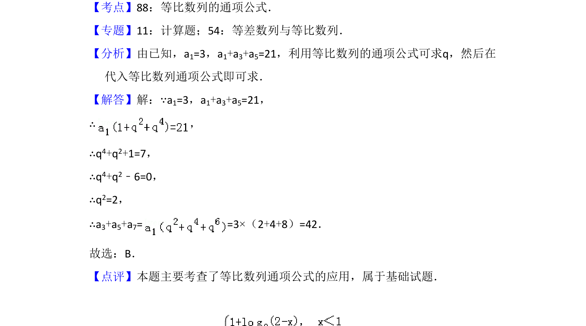

## 题面

## 摘要

已知等比数列首项及部分和，通过通项公式求公比后计算另一部分和。

## 关联考点

- [[358-等比数列概念|等比数列]]
- [[384-数列通项公式|通项公式]]

## 答案与解析

> 📄 原 PDF 第 3 页：`素材/真题/吉林/2008-2024·（吉林）数学高考真题/2015年高考数学试卷（理）（新课标Ⅱ）（解析卷）.pdf`

<!-- 题干文本-start -->
## 题干文本
4．（5分）已知等比数列{an}满足a1=3，a1+a3+a5=21，则a3+a5+a7=（　　）
A．21 B．42 C．63 D．84
<!-- 题干文本-end -->

<!-- 解析文本-start -->
## 解析文本
【考点】88：等比数列的通项公式．菁优网版权所有
【专题】11：计算题；54：等差数列与等比数列．
【分析】由已知，a1=3，a1+a3+a5=21，利用等比数列的通项公式可求q，然后在
代入等比数列通项公式即可求．
【解答】解：∵a1=3，a1+a3+a5=21，
∴，
∴q4+q2+1=7，
∴q4+q2﹣6=0，
∴q2=2，
∴a3+a5+a7= =3×（2+4+8）=42．
故选：B．
【点评】本题主要考查了等比数列通项公式的应用，属于基础试题．
<!-- 解析文本-end -->
