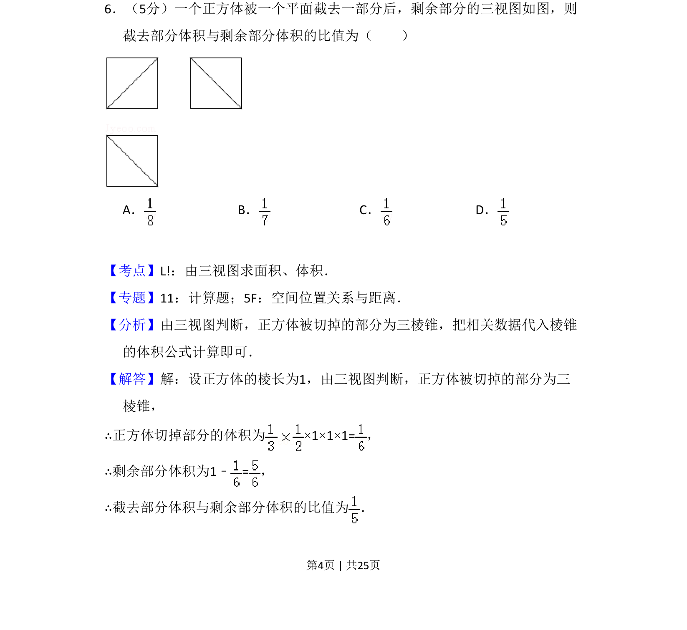

## 题面

## 摘要

由三视图还原正方体被平面所截后的几何体，计算截去部分与剩余部分的体积比。

## 关联考点

- [[235-三视图|三视图]]
- [[体积计算]]
- [[019-正方体|正方体]]
- [[346-空间几何体-多面体|棱锥]]

## 答案与解析

> 📄 原 PDF 第 4 页：`素材/真题/吉林/2008-2024·（吉林）数学高考真题/2015年高考数学试卷（理）（新课标Ⅱ）（解析卷）.pdf`
