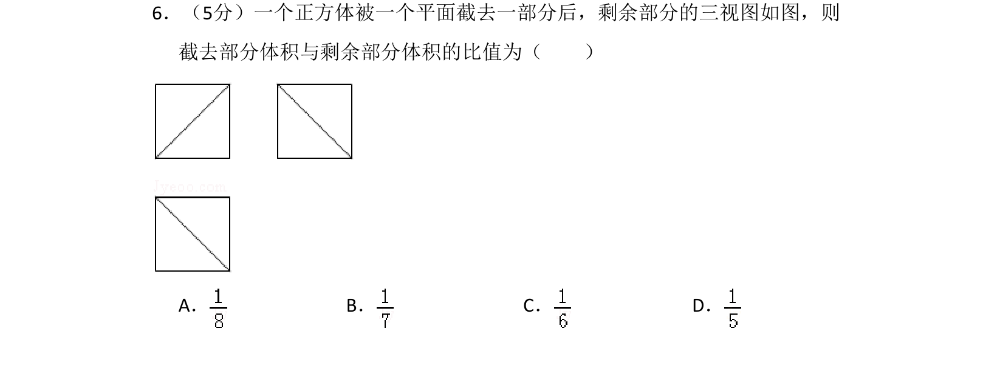
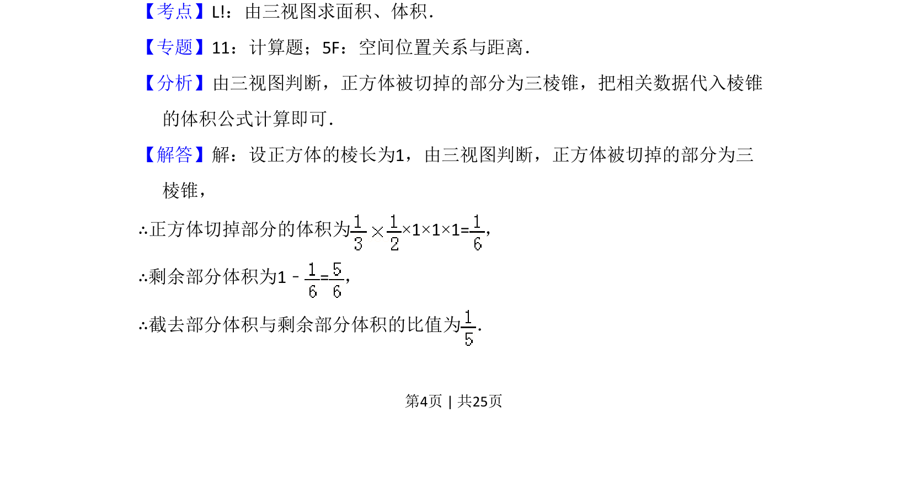
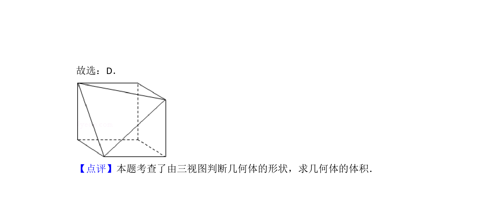

## 题面

## 摘要

由三视图还原正方体被平面所截后的几何体，计算截去部分与剩余部分的体积比。

## 关联考点

- [[235-三视图|三视图]]
- [[652-体积计算|体积计算]]
- [[019-正方体|正方体]]
- [[346-空间几何体-多面体|棱锥]]

## 答案与解析

> 📄 原 PDF 第 4 页：`素材/真题/吉林/2008-2024·（吉林）数学高考真题/2015年高考数学试卷（理）（新课标Ⅱ）（解析卷）.pdf`

<!-- 题干文本-start -->
## 题干文本
6．（5分）一个正方体被一个平面截去一部分后，剩余部分的三视图如图，则
截去部分体积与剩余部分体积的比值为（　　）
A．B．C．D．
<!-- 题干文本-end -->

<!-- 解析文本-start -->
## 解析文本
【考点】L!：由三视图求面积、体积．菁优网版权所有
【专题】11：计算题；5F：空间位置关系与距离．
【分析】由三视图判断，正方体被切掉的部分为三棱锥，把相关数据代入棱锥
的体积公式计算即可．
【解答】解：设正方体的棱长为1，由三视图判断，正方体被切掉的部分为三
棱锥，
∴正方体切掉部分的体积为×1×1×1=，
∴剩余部分体积为1﹣=，
∴截去部分体积与剩余部分体积的比值为 ．
<!-- 解析文本-end -->
