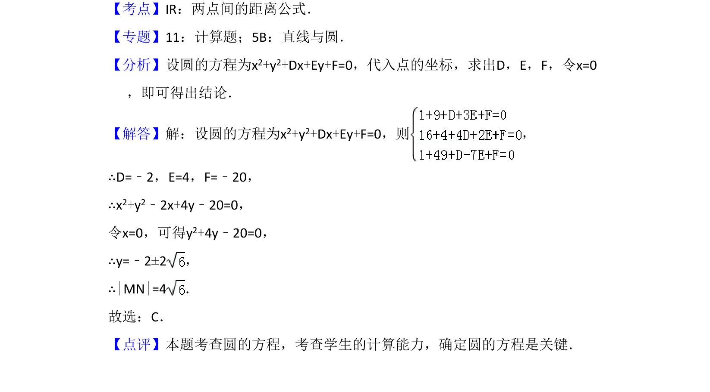

## 题面

## 摘要

根据三点坐标求圆的方程，并计算该圆与y轴相交所得弦长。

## 关联考点

- [[372-圆的一般方程|圆的一般方程]]
- [[197-待定系数法|待定系数法]]
- [[626-两点间距离公式|两点间距离公式]]

## 答案与解析

> 📄 原 PDF 第 5 页：`素材/真题/吉林/2008-2024·（吉林）数学高考真题/2015年高考数学试卷（理）（新课标Ⅱ）（解析卷）.pdf`

<!-- 题干文本-start -->
## 题干文本
7．（5分）过三点A（1，3），B（4，2），C（1，﹣7）的圆交y轴于M，N两
点，则|MN|=（　　）
A．2 B．8 C．4 D．10
<!-- 题干文本-end -->

<!-- 解析文本-start -->
## 解析文本
【考点】IR：两点间的距离公式．菁优网版权所有
【专题】11：计算题；5B：直线与圆．
【分析】设圆的方程为x2+y2+Dx+Ey+F=0，代入点的坐标，求出D，E，F，令x=0
，即可得出结论．
【解答】解：设圆的方程为x2+y2+Dx+Ey+F=0，则 ，
∴D=﹣2，E=4，F=﹣20，
∴x2+y2﹣2x+4y﹣20=0，
令x=0，可得y2+4y﹣20=0，
∴y=﹣2±2，
∴|MN|=4．
故选：C．
【点评】本题考查圆的方程，考查学生的计算能力，确定圆的方程是关键．
<!-- 解析文本-end -->
