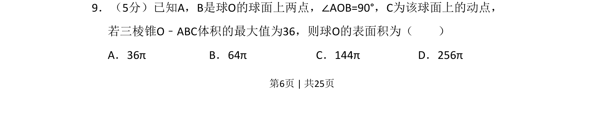
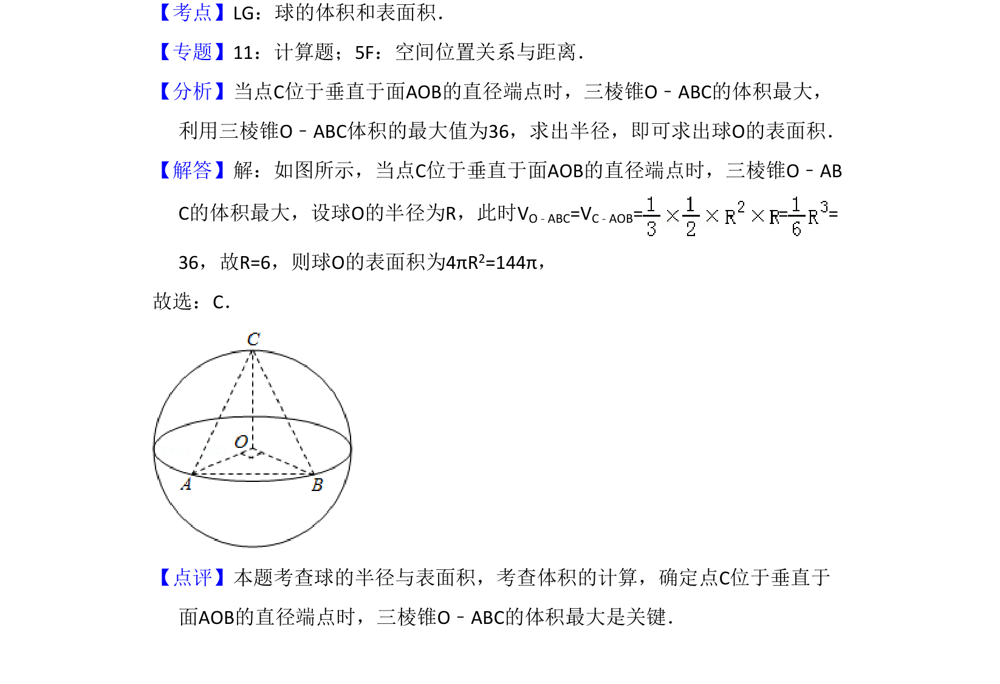

## 题面

## 摘要

已知球面上两点和动点构成三棱锥，由体积最大值求球表面积。

## 关联考点

- [[572-球体表面积|球体表面积]]
- [[1192-三棱锥体积|三棱锥体积]]
- [[665-几何最值|几何最值]]

## 答案与解析

> 📄 原 PDF 第 6 页：`素材/真题/吉林/2008-2024·（吉林）数学高考真题/2015年高考数学试卷（理）（新课标Ⅱ）（解析卷）.pdf`
