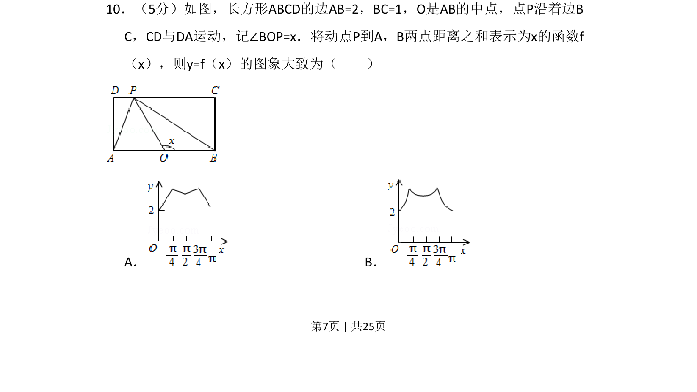

## 题面

## 摘要

根据角度变化分析动点到两定点距离之和，判断对应函数图像的形状。

## 关联考点

- [[187-函数图象|函数图像]]
- [[动点轨迹]]
- [[距离之和]]
- [[270-三角函数应用|三角函数]]

## 答案与解析

> 📄 原 PDF 第 7 页：`素材/真题/吉林/2008-2024·（吉林）数学高考真题/2015年高考数学试卷（理）（新课标Ⅱ）（解析卷）.pdf`
