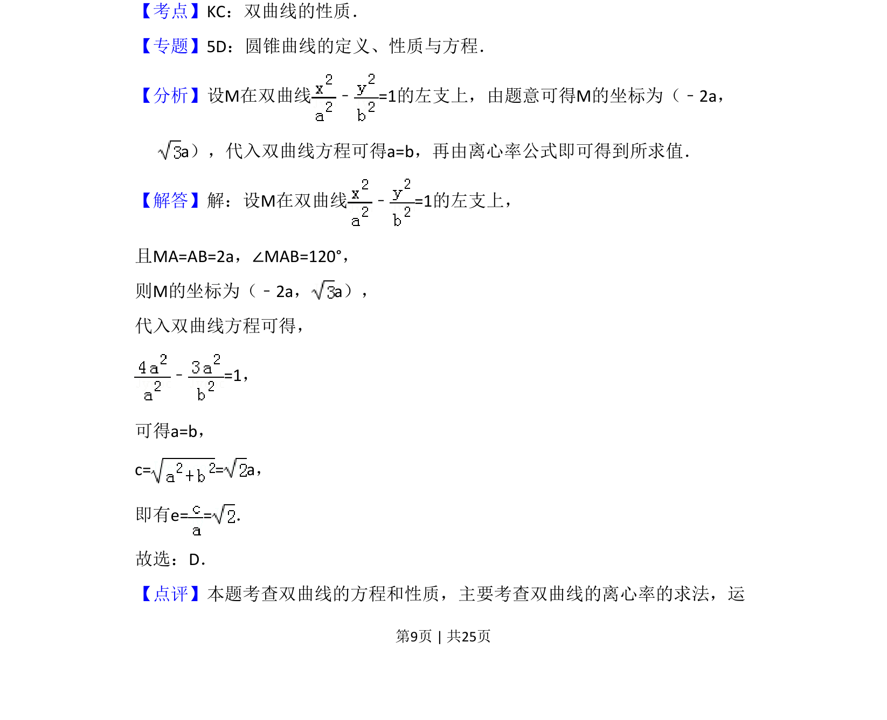

## 题面

## 摘要

利用等腰三角形和顶角条件求M坐标，代入双曲线方程得a=b，从而求出离心率

## 关联考点

- [[双曲线的性质]]
- [[391-椭圆离心率|离心率]]
- [[标准方程]]
- [[几何条件转化]]

## 答案与解析

> 📄 原 PDF 第 9 页：`素材/真题/吉林/2008-2024·（吉林）数学高考真题/2015年高考数学试卷（理）（新课标Ⅱ）（解析卷）.pdf`
