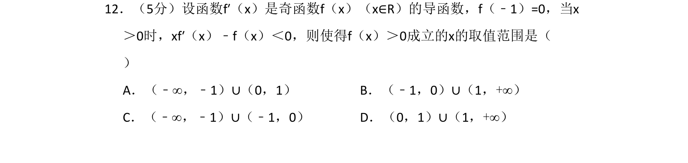
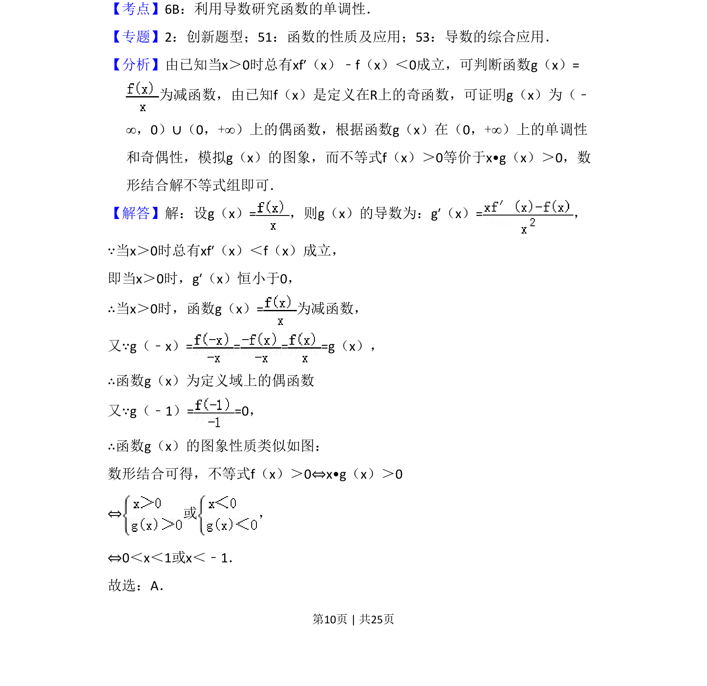

## 题面

## 摘要

本题考查利用导数研究抽象函数单调性、奇偶性，结合构造函数与不等式解法。

## 关联考点

- [[利用导数研究函数的单调性]]
- [[284-函数的奇偶性|函数的奇偶性]]
- [[数形结合思想]]
- [[构造函数]]

## 答案与解析

> 📄 原 PDF 第 10 页：`素材/真题/吉林/2008-2024·（吉林）数学高考真题/2015年高考数学试卷（理）（新课标Ⅱ）（解析卷）.pdf`
