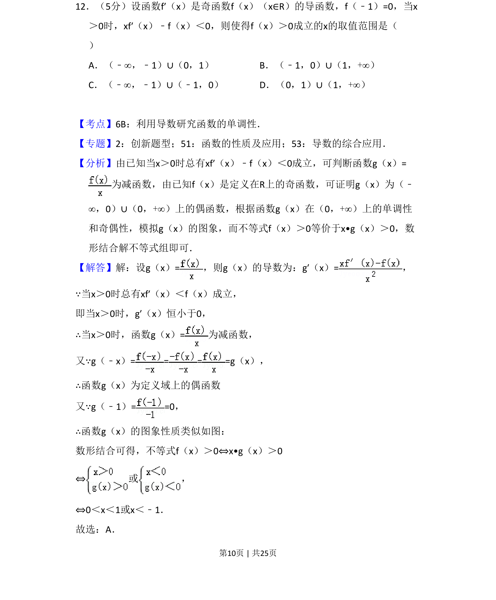
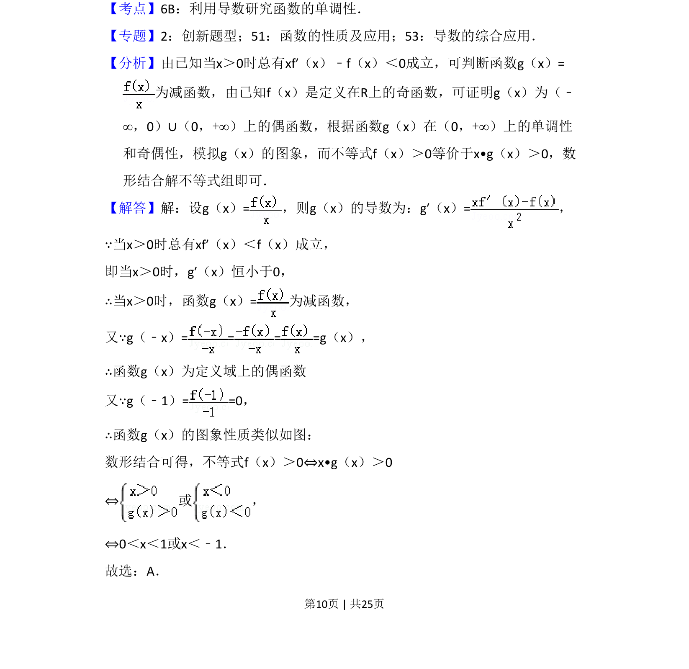
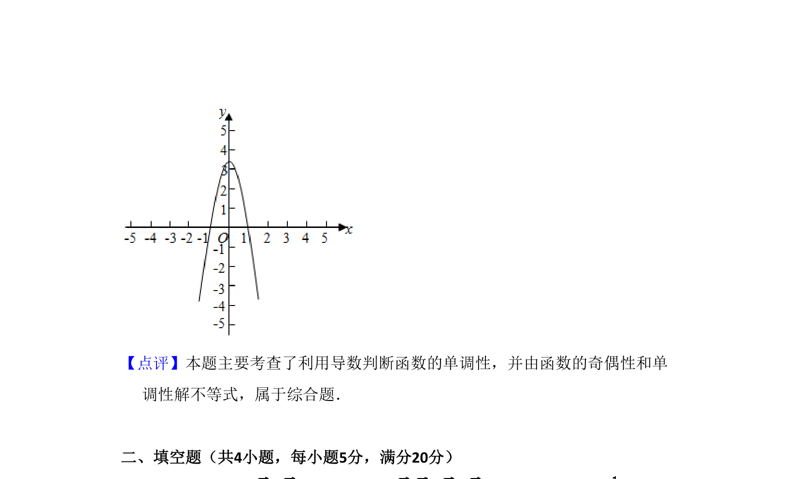

## 题面

## 摘要

本题考查利用导数研究抽象函数单调性、奇偶性，结合构造函数与不等式解法。

## 关联考点

- [[705-利用导数研究函数的单调性|利用导数研究函数的单调性]]
- [[284-函数的奇偶性|函数的奇偶性]]
- [[898-数形结合思想|数形结合思想]]
- [[923-构造函数|构造函数]]

## 答案与解析

> 📄 原 PDF 第 10 页：`素材/真题/吉林/2008-2024·（吉林）数学高考真题/2015年高考数学试卷（理）（新课标Ⅱ）（解析卷）.pdf`

<!-- 题干文本-start -->
## 题干文本
12．（5分）设函数f′（x）是奇函数f（x）（x∈R）的导函数，f（﹣1）=0，当x
＞0时，xf′（x）﹣f（x）＜0，则使得f（x）＞0成立的x的取值范围是（　　
）
A．（﹣∞，﹣1）∪（0，1）B．（﹣1，0）∪（1，+∞）
C．（﹣∞，﹣1）∪（﹣1，0）D．（0，1）∪（1，+∞）
<!-- 题干文本-end -->

<!-- 解析文本-start -->
## 解析文本
【考点】6B：利用导数研究函数的单调性．菁优网版权所有
【专题】2：创新题型；51：函数的性质及应用；53：导数的综合应用．
【分析】由已知当x＞0时总有xf′（x）﹣f（x）＜0成立，可判断函数g（x）=
为减函数，由已知f（x）是定义在R上的奇函数，可证明g（x）为（﹣
∞，0）∪（0，+∞）上的偶函数，根据函数g（x）在（0，+∞）上的单调性
和奇偶性，模拟g（x）的图象，而不等式f（x）＞0等价于x•g（x）＞0，数
形结合解不等式组即可．
【解答】解：设g（x）=，则g（x）的导数为：g′（x）=，
∵当x＞0时总有xf′（x）＜f（x）成立，
即当x＞0时，g′（x）恒小于0，
∴当x＞0时，函数g（x）=为减函数，
又∵g（﹣x）= = = =g（x），
∴函数g（x）为定义域上的偶函数
又∵g（﹣1）= =0，
∴函数g（x）的图象性质类似如图：
数形结合可得，不等式f（x）＞0⇔x•g（x）＞0
⇔或 ，
⇔0＜x＜1或x＜﹣1．
故选：A．
<!-- 解析文本-end -->
