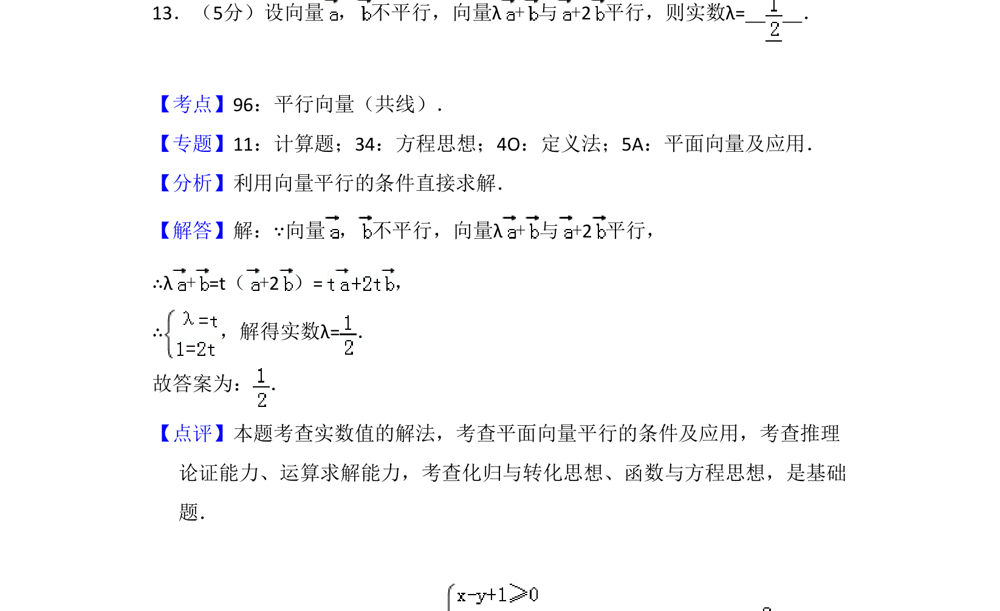
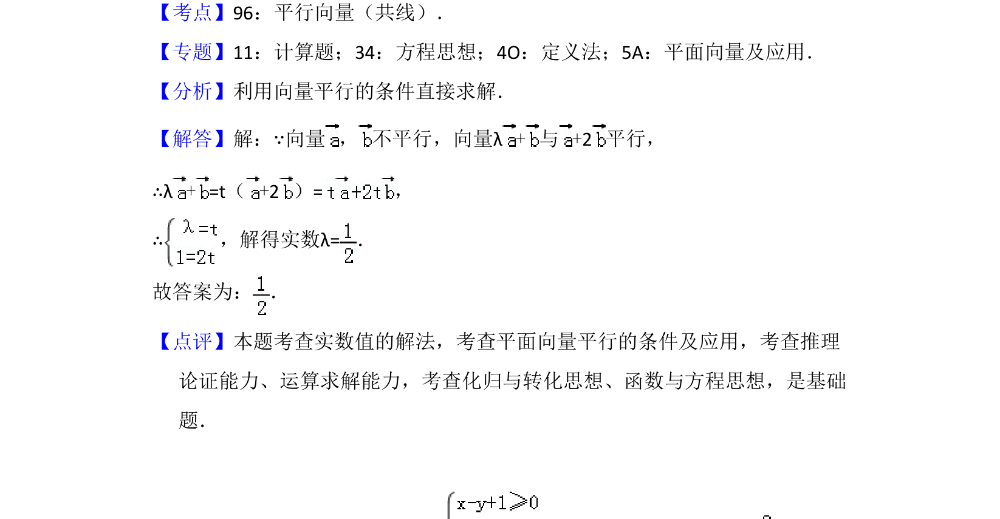

## 题面

## 摘要

本题利用向量平行的条件，通过共线定理建立方程求解参数λ。

## 关联考点

- [[848-平行向量（共线）|平行向量（共线）]]
- [[854-平面向量|平面向量]]
- [[907-方程思想|方程思想]]

## 答案与解析

> 📄 原 PDF 第 11 页：`素材/真题/吉林/2008-2024·（吉林）数学高考真题/2015年高考数学试卷（理）（新课标Ⅱ）（解析卷）.pdf`
