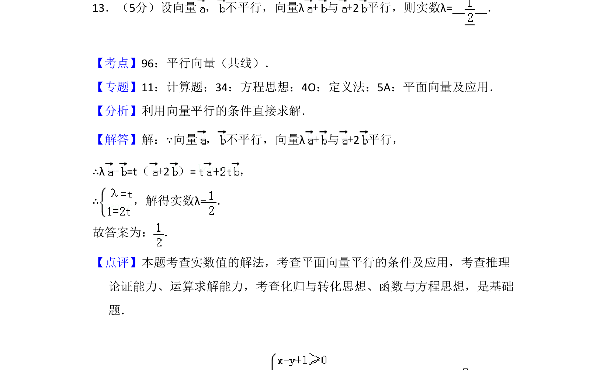
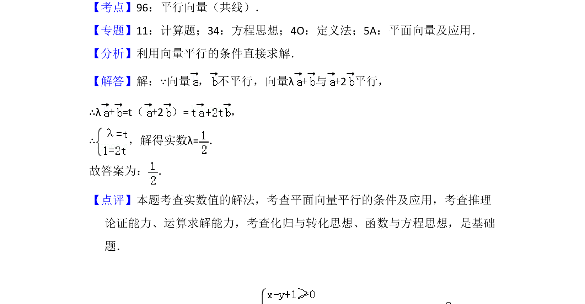

## 题面

## 摘要

本题利用向量平行的条件，通过共线定理建立方程求解参数λ。

## 关联考点

- [[847-平行向量（共线）|平行向量（共线）]]
- [[853-平面向量|平面向量]]
- [[906-方程思想|方程思想]]

## 答案与解析

> 📄 原 PDF 第 11 页：`素材/真题/吉林/2008-2024·（吉林）数学高考真题/2015年高考数学试卷（理）（新课标Ⅱ）（解析卷）.pdf`

<!-- 题干文本-start -->
## 题干文本
13．（5分）设向量 ， 不平行，向量λ+与+2平行，则实数λ=　 　．
<!-- 题干文本-end -->

<!-- 解析文本-start -->
## 解析文本
【考点】96：平行向量（共线）．菁优网版权所有
【专题】11：计算题；34：方程思想；4O：定义法；5A：平面向量及应用．
【分析】利用向量平行的条件直接求解．
【解答】解：∵向量 ， 不平行，向量λ+与+2平行，
∴λ+=t（+2）=，
∴，解得实数λ=．
故答案为： ．
【点评】本题考查实数值的解法，考查平面向量平行的条件及应用，考查推理
论证能力、运算求解能力，考查化归与转化思想、函数与方程思想，是基础
题．
<!-- 解析文本-end -->
