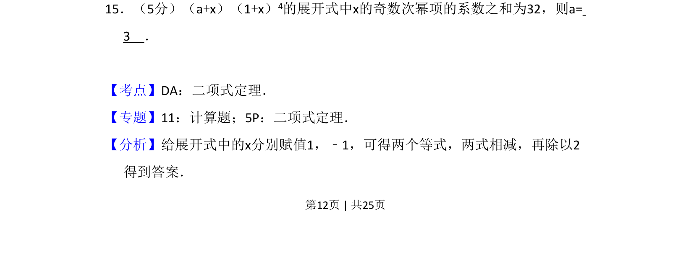
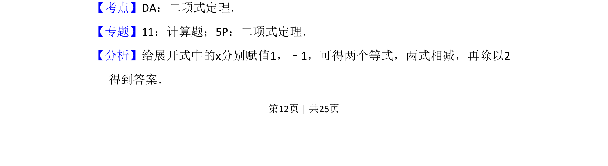
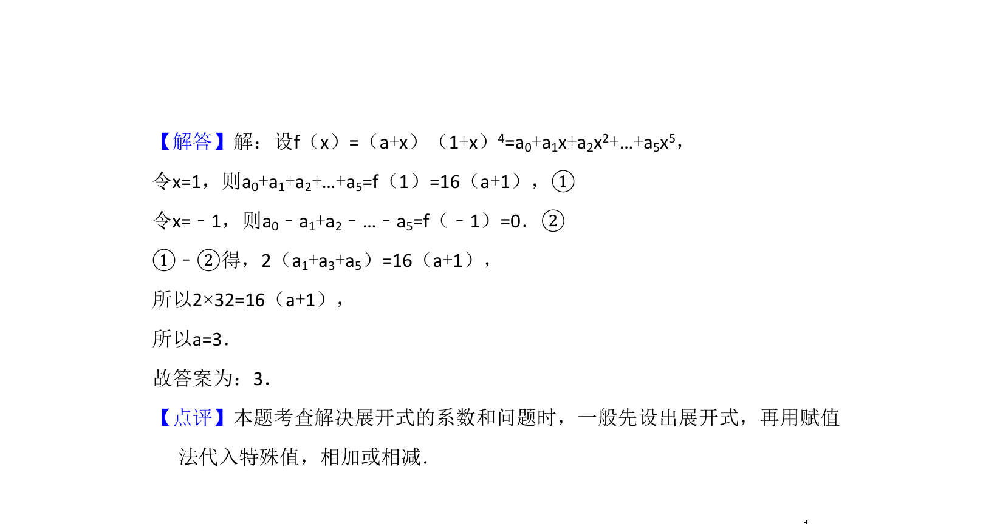

## 题面

## 摘要

给定二项展开式，利用赋值法求奇次项系数和以确定参数值。

## 关联考点

- [[472-二项式定理|二项式定理]]
- [[1116-赋值|赋值法]]
- [[1078-系数和|系数和]]

## 答案与解析

> 📄 原 PDF 第 12 页：`素材/真题/吉林/2008-2024·（吉林）数学高考真题/2015年高考数学试卷（理）（新课标Ⅱ）（解析卷）.pdf`
