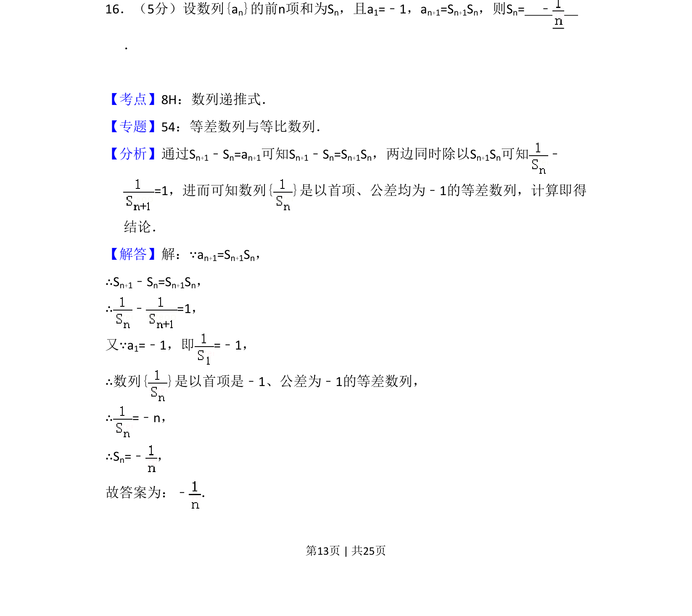
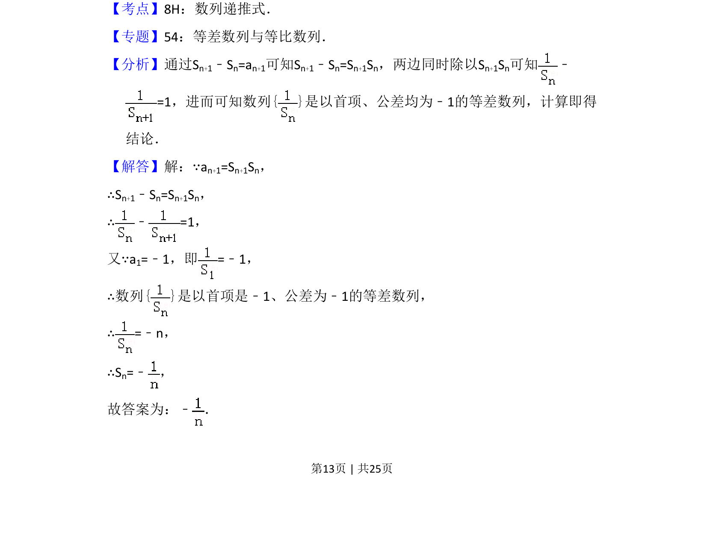
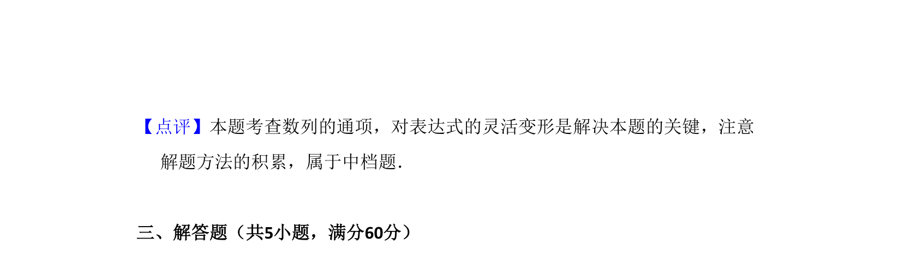

## 题面

## 摘要

本题考查由数列递推关系构造等差数列求前n项和。

## 关联考点

- [[894-数列递推式|数列递推式]]
- [[356-等差数列概念|等差数列]]
- [[355-等差数列前n项和|前n项和]]

## 答案与解析

> 📄 原 PDF 第 13 页：`素材/真题/吉林/2008-2024·（吉林）数学高考真题/2015年高考数学试卷（理）（新课标Ⅱ）（解析卷）.pdf`

<!-- 题干文本-start -->
## 题干文本
16．（5分）设数列{an}的前n项和为Sn，且a1=﹣1，an+1=Sn+1Sn，则Sn=　﹣ 　
．
<!-- 题干文本-end -->

<!-- 解析文本-start -->
## 解析文本
【考点】8H：数列递推式．菁优网版权所有
【专题】54：等差数列与等比数列．
【分析】通过Sn+1﹣Sn=an+1可知Sn+1﹣Sn=Sn+1Sn，两边同时除以Sn+1Sn可知 ﹣
=1，进而可知数列{ }是以首项、公差均为﹣1的等差数列，计算即得
结论．
【解答】解：∵an+1=Sn+1Sn，
∴Sn+1﹣Sn=Sn+1Sn，
∴﹣=1，
又∵a1=﹣1，即=﹣1，
∴数列{ }是以首项是﹣1、公差为﹣1的等差数列，
∴=﹣n，
∴Sn=﹣ ，
故答案为：﹣ ．
<!-- 解析文本-end -->
