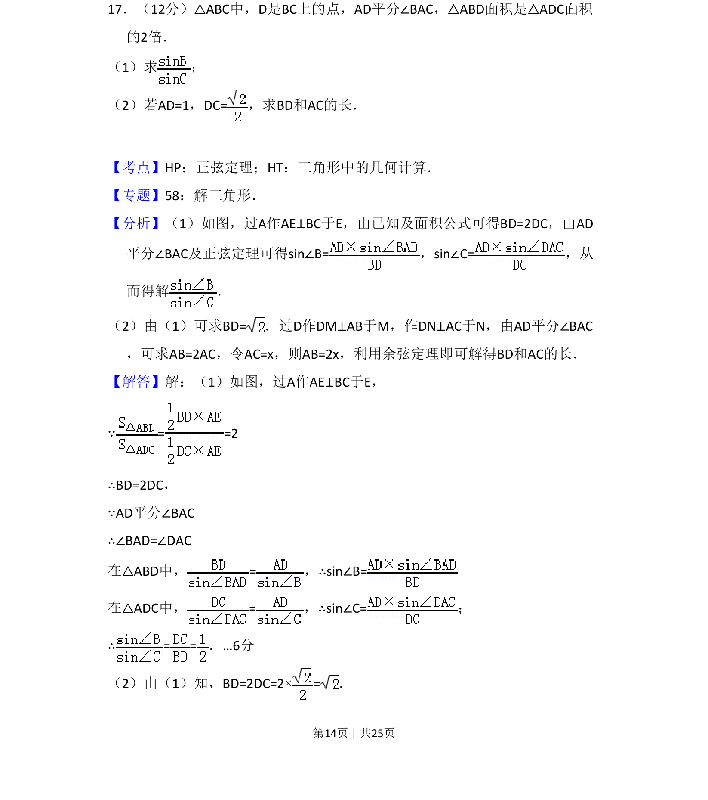

## 题面

## 摘要

三角形中角平分线与面积关系问题，通过正弦定理求边长比，用余弦定理求线段长。

## 关联考点

- [[126-定理|正弦定理]]
- [[062-多边形面积|三角形面积]]
- [[126-定理|余弦定理]]
- [[角平分线性质]]

## 答案与解析

> 📄 原 PDF 第 14 页：`素材/真题/吉林/2008-2024·（吉林）数学高考真题/2015年高考数学试卷（理）（新课标Ⅱ）（解析卷）.pdf`
