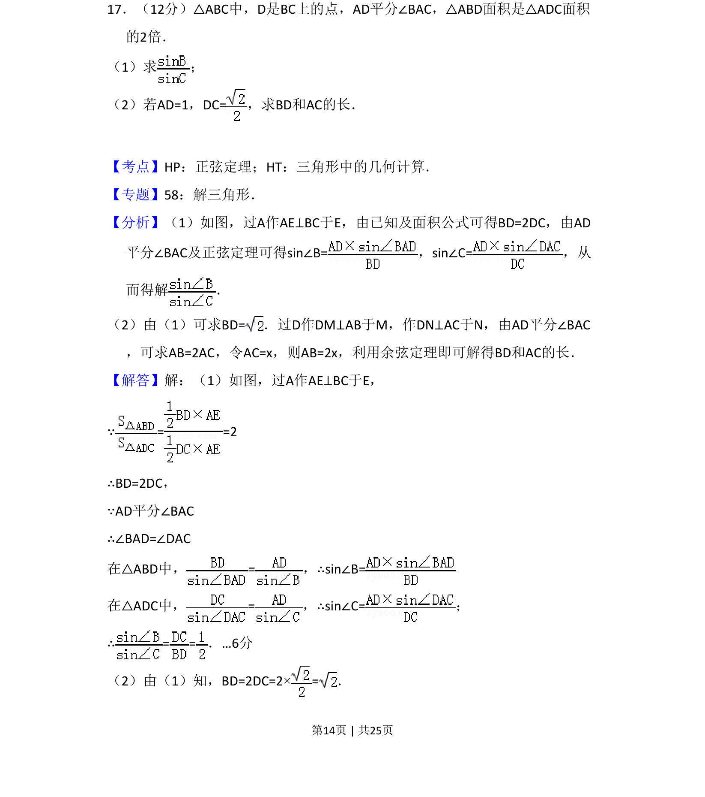
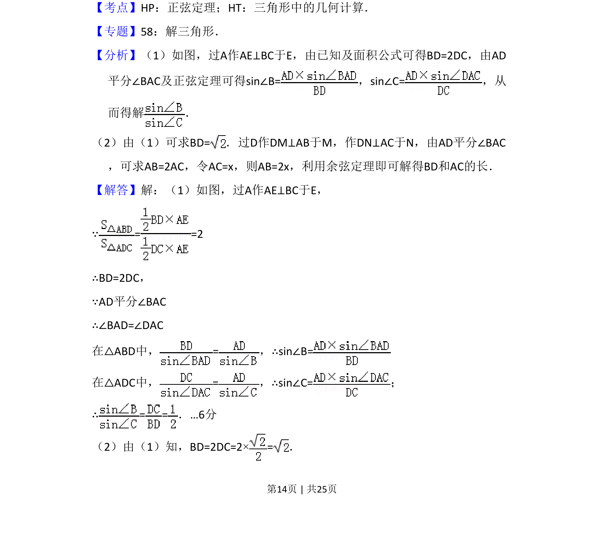
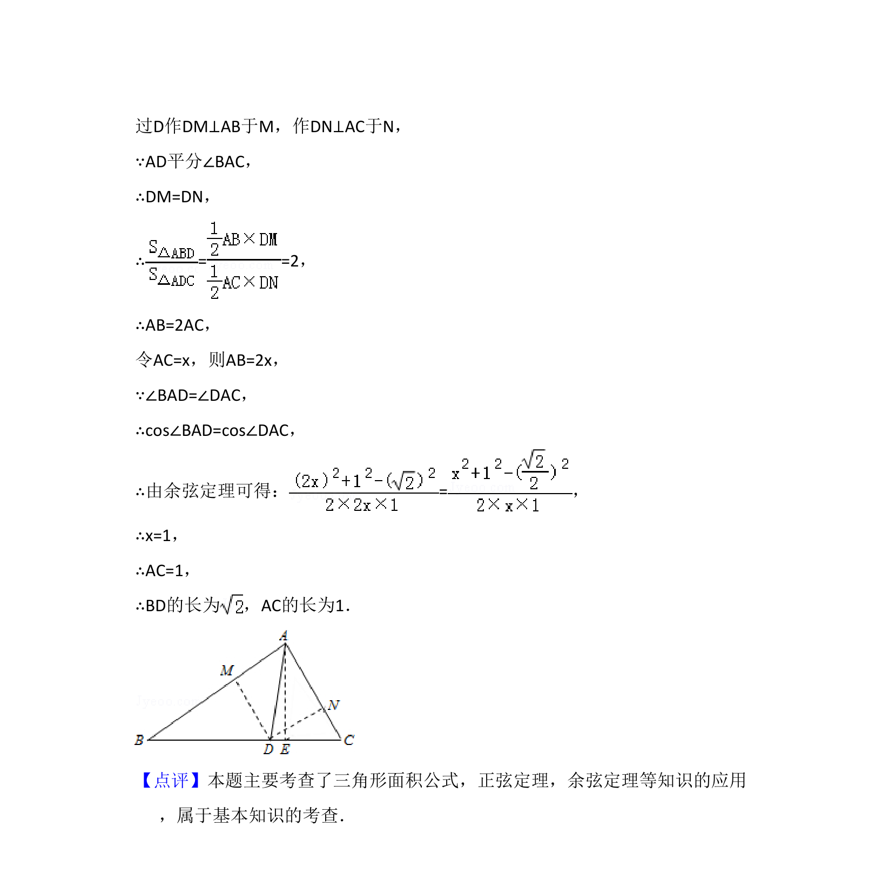

## 题面

## 摘要

三角形中角平分线与面积关系问题，通过正弦定理求边长比，用余弦定理求线段长。

## 关联考点

- [[126-定理|正弦定理]]
- [[062-多边形面积|三角形面积]]
- [[126-定理|余弦定理]]
- [[1104-角平分线性质|角平分线性质]]

## 答案与解析

> 📄 原 PDF 第 14 页：`素材/真题/吉林/2008-2024·（吉林）数学高考真题/2015年高考数学试卷（理）（新课标Ⅱ）（解析卷）.pdf`

<!-- 题干文本-start -->
## 题干文本
17．（12分）△ABC中，D是BC上的点，AD平分∠BAC，△ABD面积是△ADC面积
的2倍．
（1）求 ；
（2）若AD=1，DC=，求BD和AC的长．
<!-- 题干文本-end -->

<!-- 解析文本-start -->
## 解析文本
【考点】HP：正弦定理；HT：三角形中的几何计算．菁优网版权所有
【专题】58：解三角形．
【分析】（1）如图，过A作AE⊥BC于E，由已知及面积公式可得BD=2DC，由AD
平分∠BAC及正弦定理可得sin∠B=，sin∠C=，从
而得解 ．
（2）由（1）可求BD=．过D作DM⊥AB于M，作DN⊥AC于N，由AD平分∠BAC
，可求AB=2AC，令AC=x，则AB=2x，利用余弦定理即可解得BD和AC的长．
【解答】解：（1）如图，过A作AE⊥BC于E，
∵= =2
∴BD=2DC，
∵AD平分∠BAC
∴∠BAD=∠DAC
在△ABD中，=，∴sin∠B=
在△ADC中，=，∴sin∠C=；
∴= =．…6分
（2）由（1）知，BD=2DC=2×=．
<!-- 解析文本-end -->
