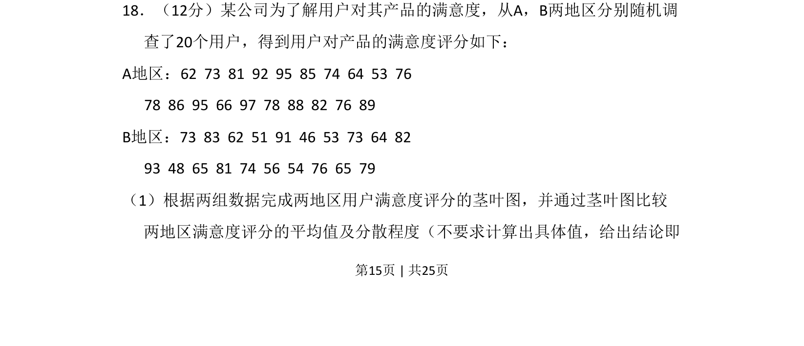

## 题面

## 摘要

该题考查根据数据绘制茎叶图，并通过茎叶图定性比较两组数据的平均值与分散程度。

## 关联考点

- [[360-茎叶图|茎叶图]]
- [[数据分布比较]]
- [[055-平均数|平均数]]
- [[339-方差与标准差-高中|离散程度]]

## 答案与解析

> 📄 原 PDF 第 15 页：`素材/真题/吉林/2008-2024·（吉林）数学高考真题/2015年高考数学试卷（理）（新课标Ⅱ）（解析卷）.pdf`
