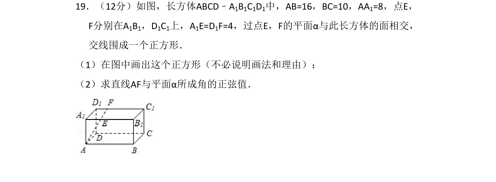
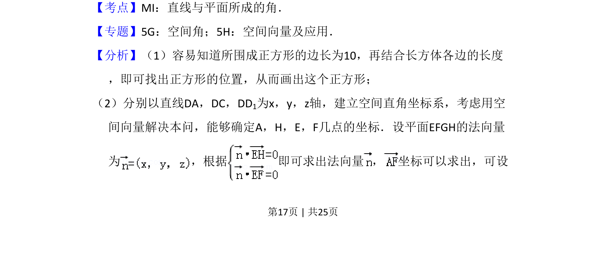
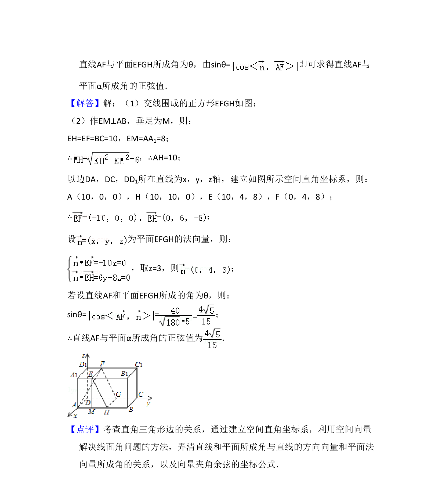

## 题面

## 摘要

本题考查长方体中被平面截得的正方形画法及直线与平面所成角的正弦值计算。

## 关联考点

- [[1013-直线与平面所成的角|直线与平面所成的角]]
- [[1051-空间向量及其应用|空间向量及其应用]]
- [[411-空间平面法向量|法向量]]

## 答案与解析

> 📄 原 PDF 第 17 页：`素材/真题/吉林/2008-2024·（吉林）数学高考真题/2015年高考数学试卷（理）（新课标Ⅱ）（解析卷）.pdf`
