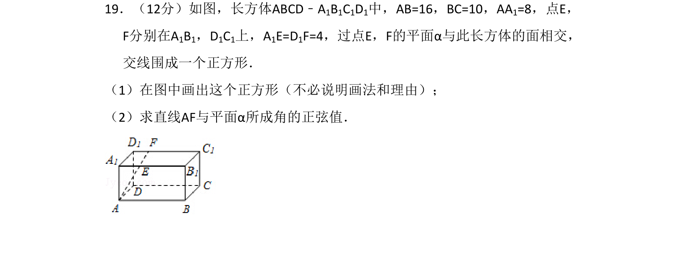
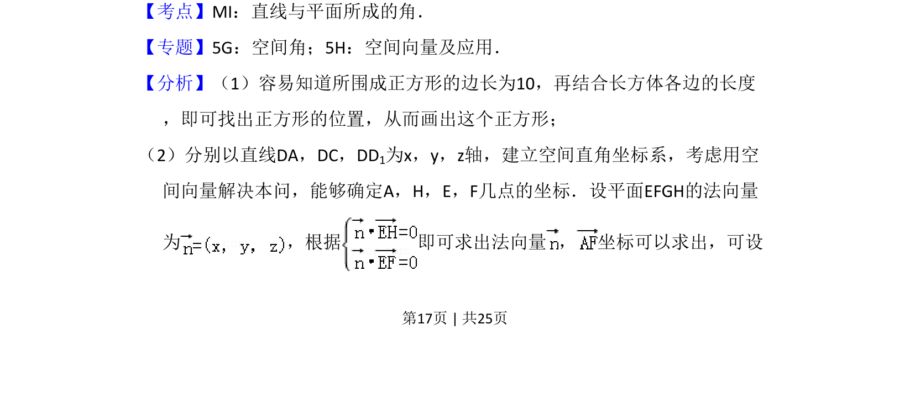
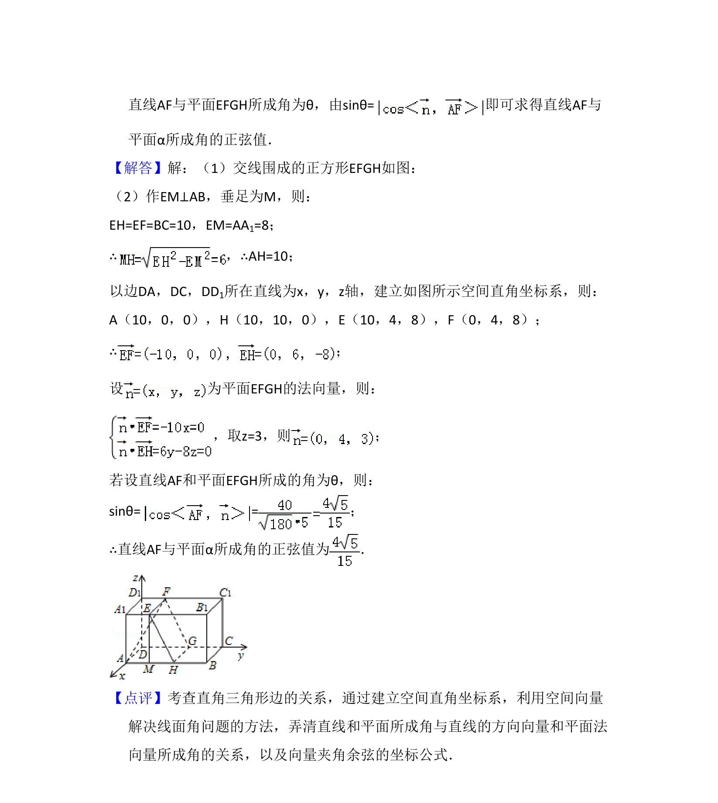

## 题面

## 摘要

本题考查长方体中被平面截得的正方形画法及直线与平面所成角的正弦值计算。

## 关联考点

- [[1013-直线与平面所成的角|直线与平面所成的角]]
- [[1051-空间向量及其应用|空间向量及其应用]]
- [[411-空间平面法向量|法向量]]

## 答案与解析

> 📄 原 PDF 第 17 页：`素材/真题/吉林/2008-2024·（吉林）数学高考真题/2015年高考数学试卷（理）（新课标Ⅱ）（解析卷）.pdf`

<!-- 题干文本-start -->
## 题干文本
19．（12分）如图，长方体ABCD﹣A1B1C1D1中，AB=16，BC=10，AA1=8，点E，
F分别在A1B1，D1C1上，A1E=D1F=4，过点E，F的平面α与此长方体的面相交，
交线围成一个正方形．
（1）在图中画出这个正方形（不必说明画法和理由）；
（2）求直线AF与平面α所成角的正弦值．
<!-- 题干文本-end -->

<!-- 解析文本-start -->
## 解析文本
【考点】MI：直线与平面所成的角．菁优网版权所有
【专题】5G：空间角；5H：空间向量及应用．
【分析】（1）容易知道所围成正方形的边长为10，再结合长方体各边的长度
，即可找出正方形的位置，从而画出这个正方形；
（2）分别以直线DA，DC，DD1为x，y，z轴，建立空间直角坐标系，考虑用空
间向量解决本问，能够确定A，H，E，F几点的坐标．设平面EFGH的法向量
为 ，根据 即可求出法向量 ， 坐标可以求出，可设
<!-- 解析文本-end -->
