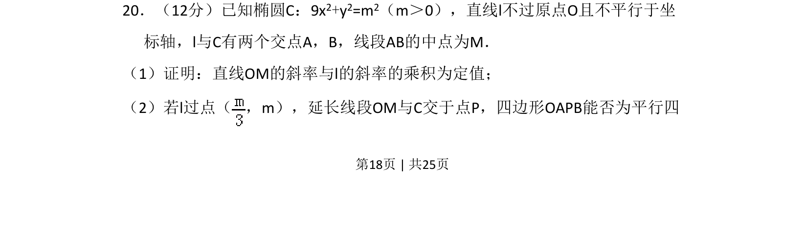
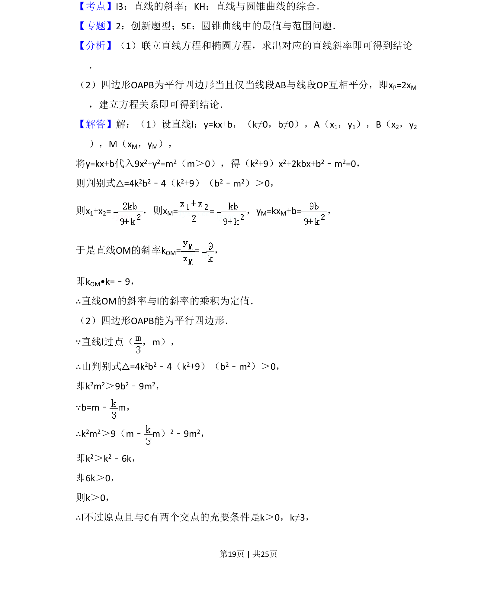
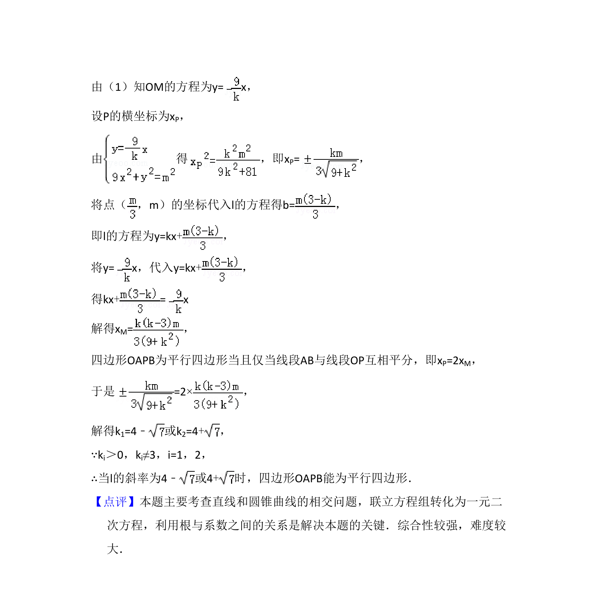

## 题面

## 摘要

考查椭圆与直线相交的中点弦问题，证明斜率乘积为定值并探索四边形形状。

## 关联考点

- [[941-椭圆方程|椭圆方程]]
- [[1214-中点弦|中点弦]]
- [[558-斜率乘积定值|斜率乘积定值]]
- [[194-平行四边形判定|平行四边形判定]]

## 答案与解析

> 📄 原 PDF 第 18 页：`素材/真题/吉林/2008-2024·（吉林）数学高考真题/2015年高考数学试卷（理）（新课标Ⅱ）（解析卷）.pdf`
