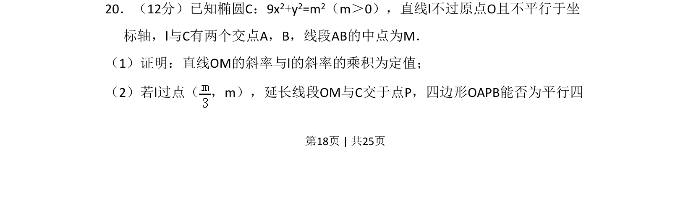
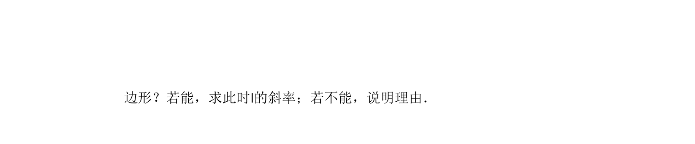
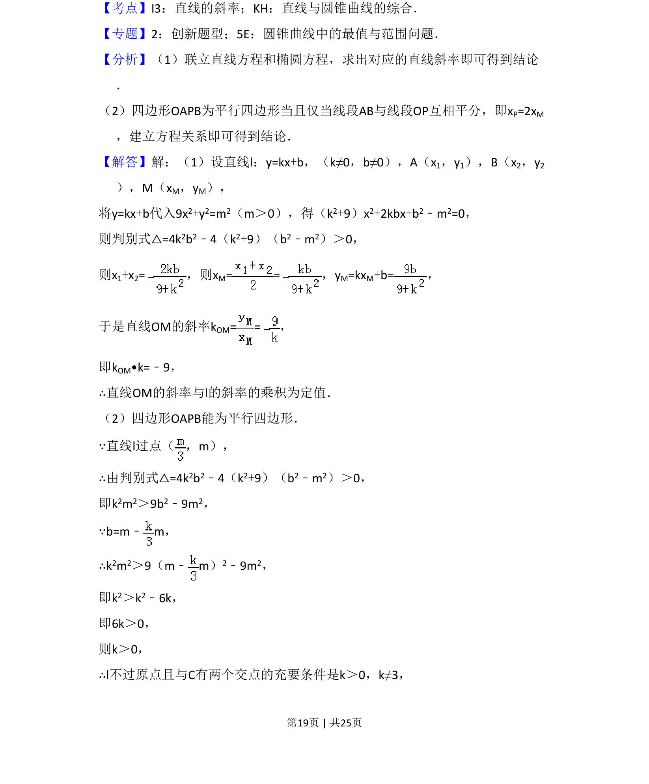
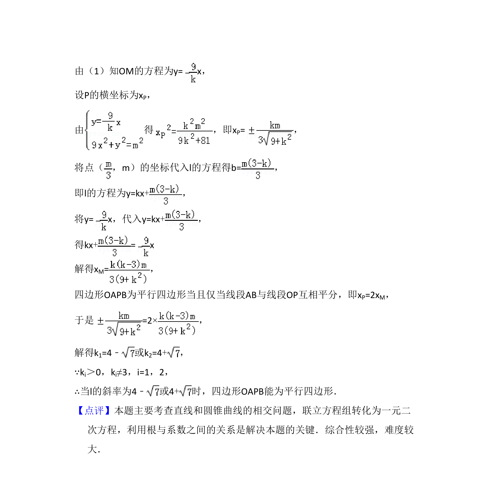

## 题面

## 摘要

考查椭圆与直线相交的中点弦问题，证明斜率乘积为定值并探索四边形形状。

## 关联考点

- [[940-椭圆方程|椭圆方程]]
- [[1213-中点弦|中点弦]]
- [[558-斜率乘积定值|斜率乘积定值]]
- [[194-平行四边形判定|平行四边形判定]]

## 答案与解析

> 📄 原 PDF 第 18 页：`素材/真题/吉林/2008-2024·（吉林）数学高考真题/2015年高考数学试卷（理）（新课标Ⅱ）（解析卷）.pdf`

<!-- 题干文本-start -->
## 题干文本
20．（12分）已知椭圆C：9x2+y2=m2（m＞0），直线l不过原点O且不平行于坐
标轴，l与C有两个交点A，B，线段AB的中点为M．
（1）证明：直线OM的斜率与l的斜率的乘积为定值；
（2）若l过点（ ，m），延长线段OM与C交于点P，四边形OAPB能否为平行四
<!-- 题干文本-end -->

<!-- 解析文本-start -->
## 解析文本

<!-- 解析文本-end -->
