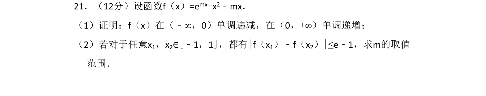

## 题面

## 摘要

利用导数研究含参函数的单调性并利用最值解决不等式恒成立求参数范围

## 关联考点

- [[导数与单调性]]
- [[导数与最值]]
- [[450-恒成立问题|恒成立问题]]
- [[参数范围]]

## 答案与解析

> 📄 原 PDF 第 20 页：`素材/真题/吉林/2008-2024·（吉林）数学高考真题/2015年高考数学试卷（理）（新课标Ⅱ）（解析卷）.pdf`
