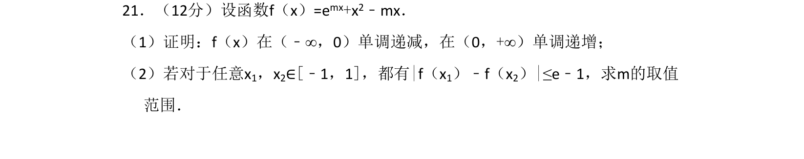
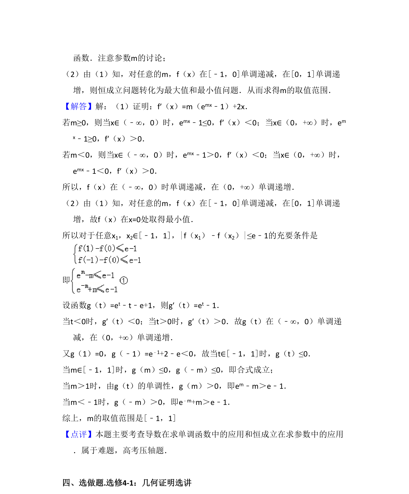

## 题面

## 摘要

利用导数研究含参函数的单调性并利用最值解决不等式恒成立求参数范围

## 关联考点

- [[705-利用导数研究函数的单调性|导数与单调性]]
- [[838-导数与最值|导数与最值]]
- [[450-恒成立问题|恒成立问题]]
- [[726-参数范围|参数范围]]

## 答案与解析

> 📄 原 PDF 第 20 页：`素材/真题/吉林/2008-2024·（吉林）数学高考真题/2015年高考数学试卷（理）（新课标Ⅱ）（解析卷）.pdf`

<!-- 题干文本-start -->
## 题干文本
21．（12分）设函数f（x）=emx+x2﹣mx．
（1）证明：f（x）在（﹣∞，0）单调递减，在（0，+∞）单调递增；
（2）若对于任意x1，x2∈[﹣1，1]，都有|f（x1）﹣f（x2）|≤e﹣1，求m的取值
范围．
<!-- 题干文本-end -->

<!-- 解析文本-start -->
## 解析文本
【考点】6B：利用导数研究函数的单调性；6E：利用导数研究函数的最值．菁优网版权所有
【专题】2：创新题型；52：导数的概念及应用．
【分析】（1）利用f′（x）≥0说明函数为增函数，利用f′（x）≤0说明函数为减
<!-- 解析文本-end -->
