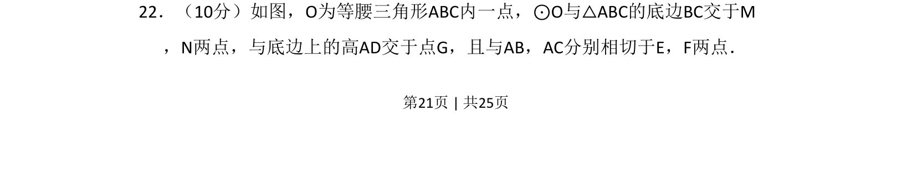
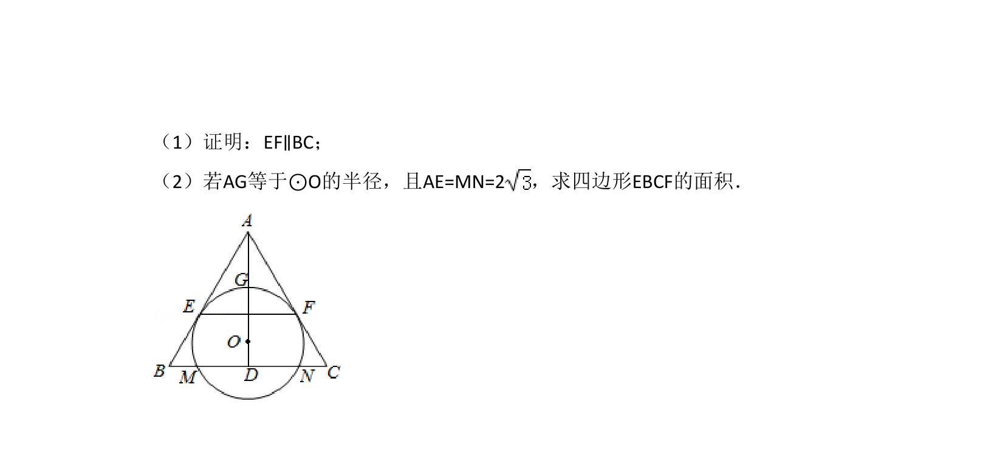
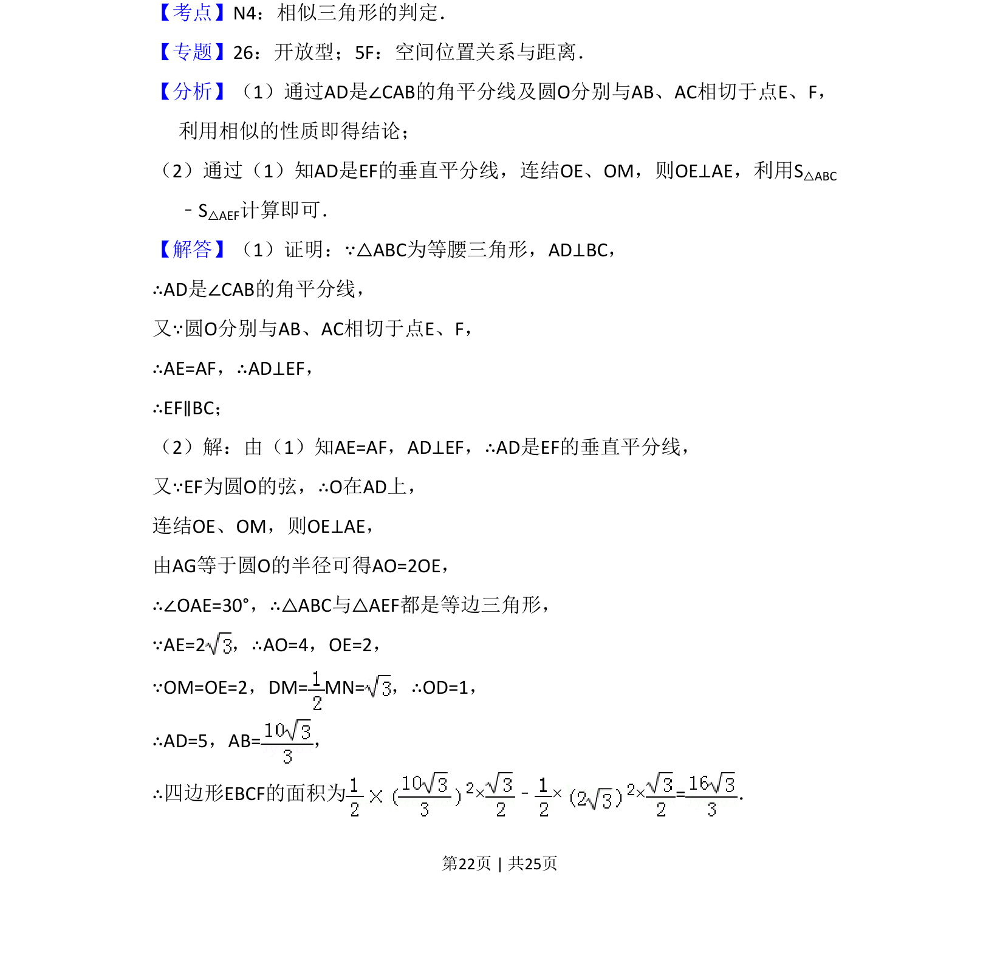
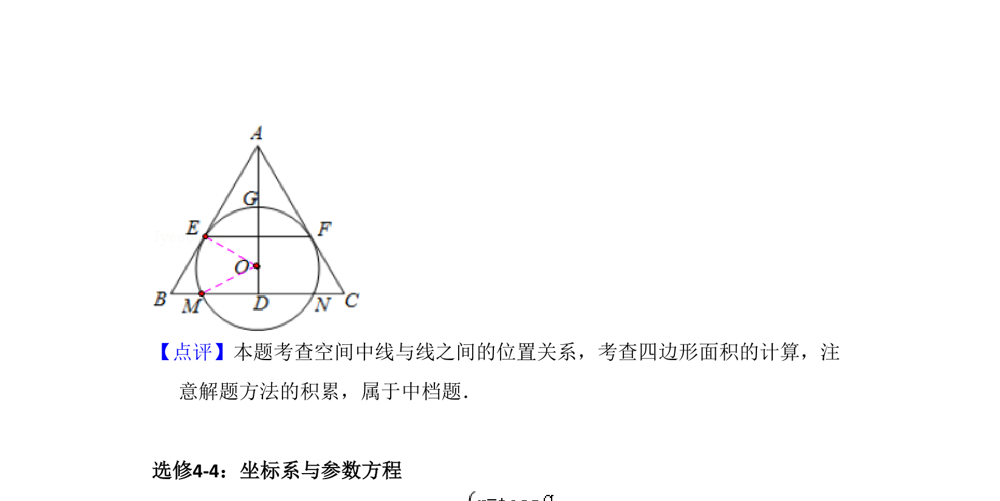

## 题面

## 摘要

几何综合题，考查等腰三角形性质、圆的切线与弦的关系。

## 关联考点

- [[171-等腰三角形性质|等腰三角形]]
- [[217-切线|圆的切线]]
- [[866-弦心距|弦心距]]
- [[670-几何综合|几何综合]]

## 答案与解析

> 📄 原 PDF 第 21 页：`素材/真题/吉林/2008-2024·（吉林）数学高考真题/2015年高考数学试卷（理）（新课标Ⅱ）（解析卷）.pdf`
