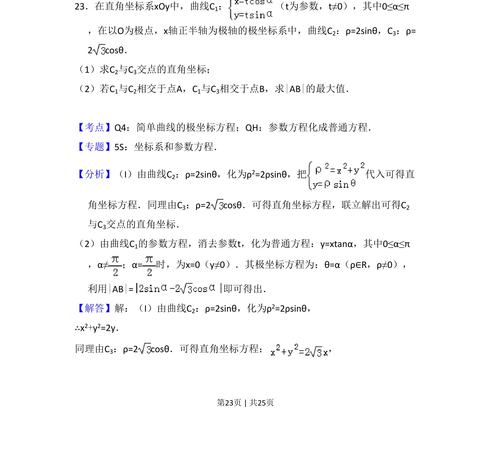
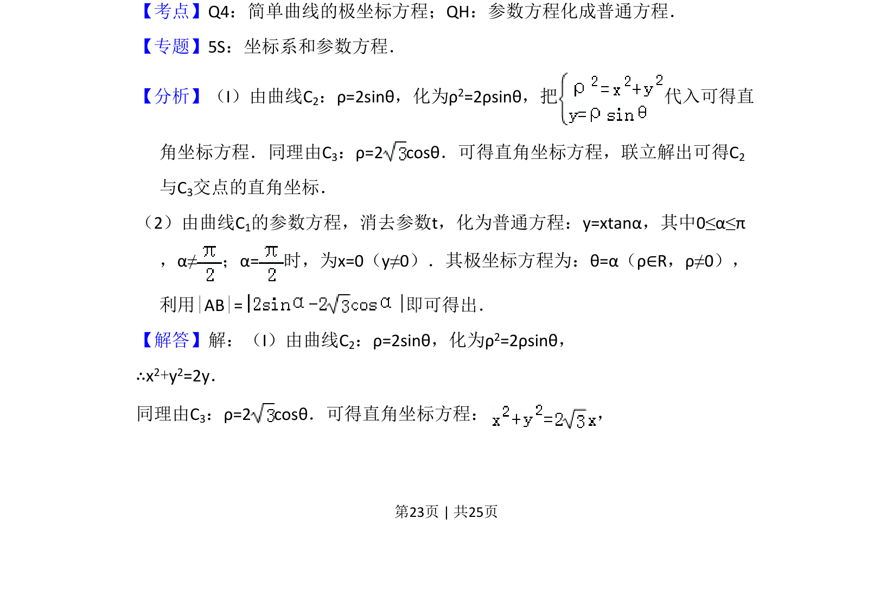
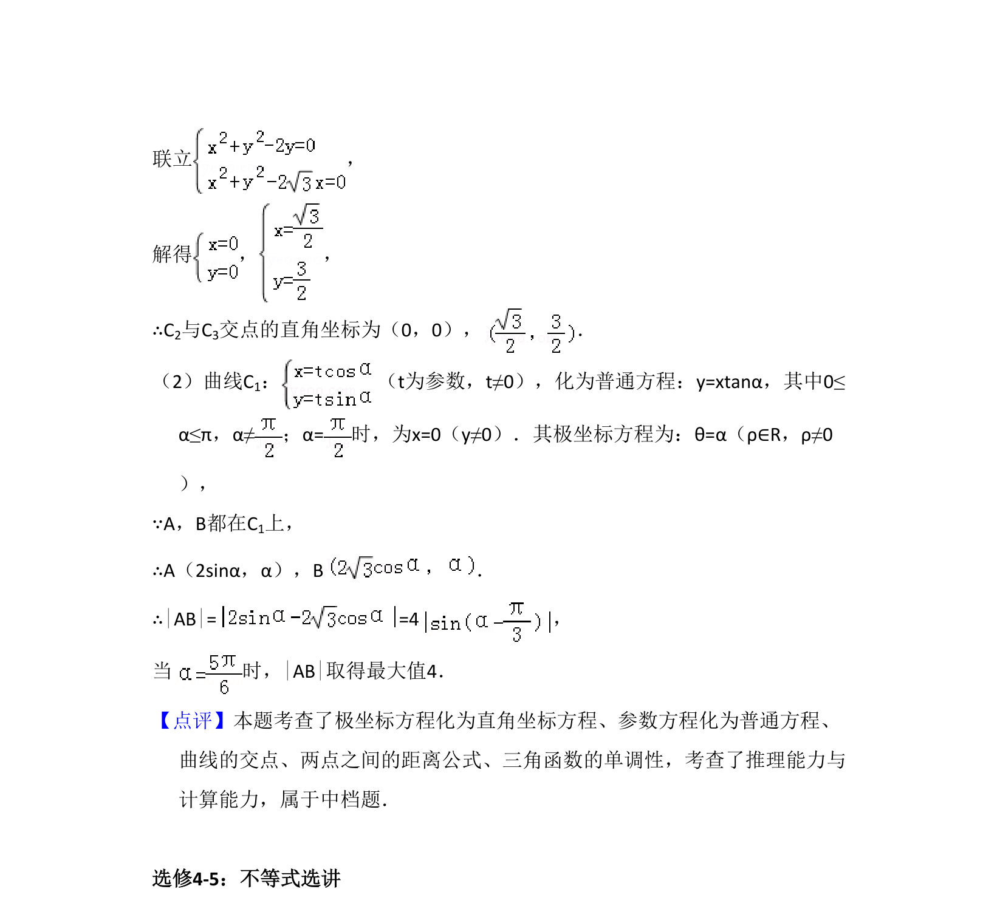

## 题面

## 摘要

本题主要考查极坐标方程与直角坐标方程的互化、参数方程化为普通方程，并求解两曲线交点及弦长的最大值。

## 关联考点

- [[921-极坐标方程|极坐标方程]]
- [[061-方程|参数方程]]
- [[909-普通方程|普通方程]]
- [[866-弦长|弦长]]

## 答案与解析

> 📄 原 PDF 第 23 页：`素材/真题/吉林/2008-2024·（吉林）数学高考真题/2015年高考数学试卷（理）（新课标Ⅱ）（解析卷）.pdf`
