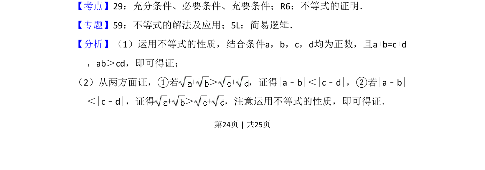

## 题面

## 摘要

本题考查利用不等式性质证明充要条件。

## 关联考点

- [[278-充分条件必要条件|充分条件]]
- [[278-充分条件必要条件|必要条件]]
- [[279-充要条件|充要条件]]
- [[不等式的证明]]

## 答案与解析

> 📄 原 PDF 第 24 页：`素材/真题/吉林/2008-2024·（吉林）数学高考真题/2015年高考数学试卷（理）（新课标Ⅱ）（解析卷）.pdf`
