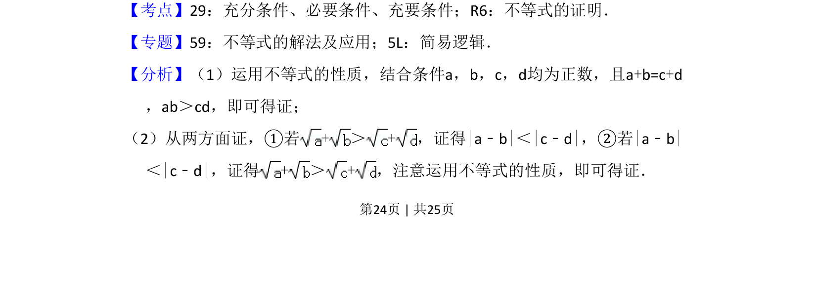
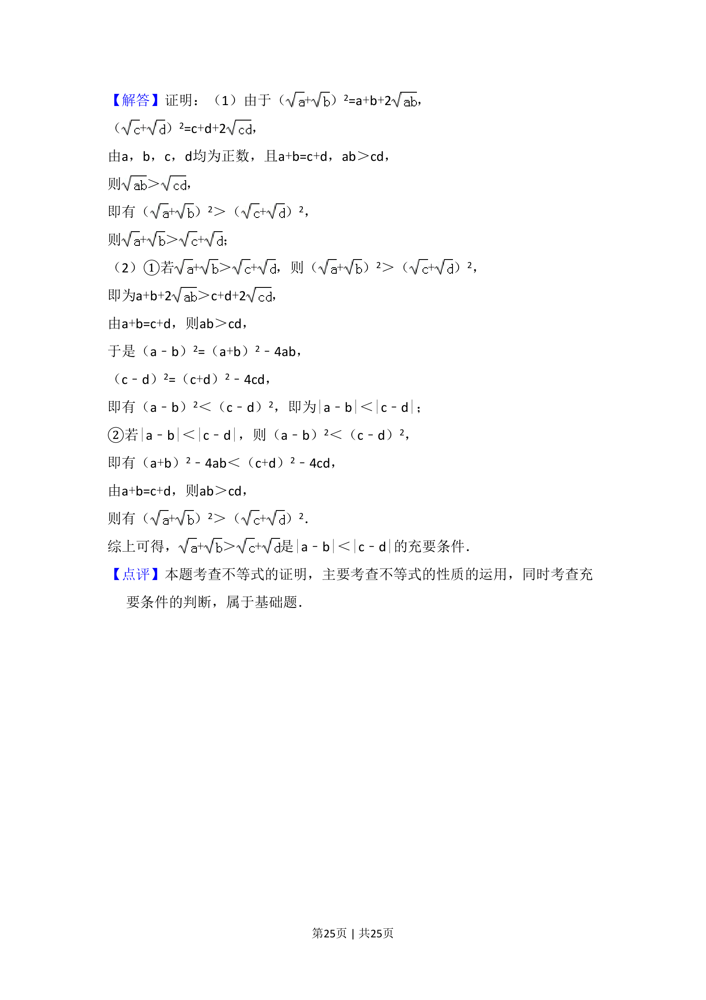

## 题面

## 摘要

本题考查利用不等式性质证明充要条件。

## 关联考点

- [[278-充分条件必要条件|充分条件]]
- [[278-充分条件必要条件|必要条件]]
- [[279-充要条件|充要条件]]
- [[624-不等式的证明|不等式的证明]]

## 答案与解析

> 📄 原 PDF 第 24 页：`素材/真题/吉林/2008-2024·（吉林）数学高考真题/2015年高考数学试卷（理）（新课标Ⅱ）（解析卷）.pdf`

<!-- 题干文本-start -->
## 题干文本
24．设a，b，c，d均为正数，且a+b=c+d，证明：
（1）若ab＞cd，则+＞+；
（2）+＞+是|a﹣b|＜|c﹣d|的充要条件．
<!-- 题干文本-end -->

<!-- 解析文本-start -->
## 解析文本
【考点】29：充分条件、必要条件、充要条件；R6：不等式的证明．菁优网版权所有
【专题】59：不等式的解法及应用；5L：简易逻辑．
【分析】（1）运用不等式的性质，结合条件a，b，c，d均为正数，且a+b=c+d
，ab＞cd，即可得证；
（2）从两方面证，①若+＞+，证得|a﹣b|＜|c﹣d|，②若|a﹣b|
＜|c﹣d|，证得+＞+，注意运用不等式的性质，即可得证．
<!-- 解析文本-end -->
