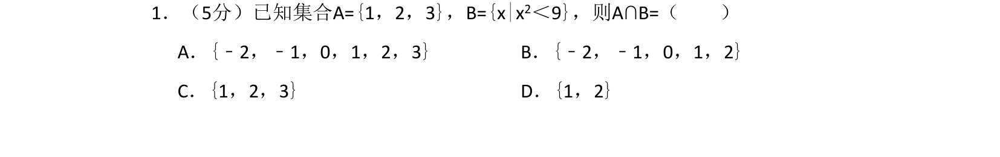
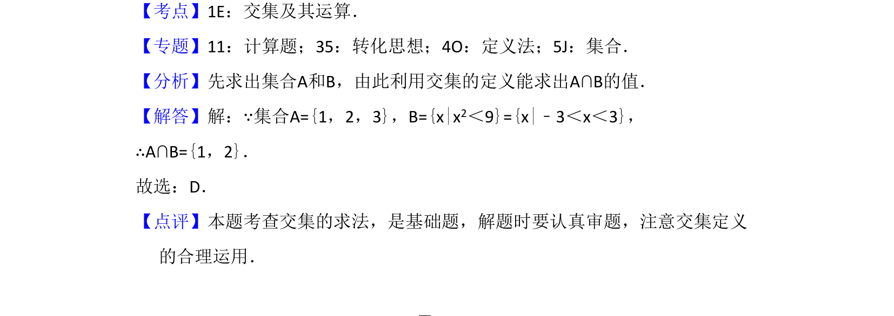

## 题面

## 摘要

已知集合A和B，求解交集，考查集合表示与交集运算。

## 关联考点

- [[1140-集合的表示法|集合的表示法]]
- [[645-交集及其运算|交集及其运算]]

## 答案与解析

> 📄 原 PDF 第 1 页：`素材/真题/吉林/2008-2024·（吉林）数学高考真题/2016年高考数学试卷（文）（新课标Ⅱ）（解析卷）.pdf`

<!-- 题干文本-start -->
## 题干文本
1．（5分）已知集合A={1，2，3}，B={x|x2＜9}，则A∩B=（　　）
A．{﹣2，﹣1，0，1，2，3}B．{﹣2，﹣1，0，1，2}
C．{1，2，3}D．{1，2}
<!-- 题干文本-end -->

<!-- 解析文本-start -->
## 解析文本
【考点】1E：交集及其运算．菁优网版权所有
【专题】11：计算题；35：转化思想；4O：定义法；5J：集合．
【分析】先求出集合A和B，由此利用交集的定义能求出A∩B的值．
【解答】解：∵集合A={1，2，3}，B={x|x2＜9}={x|﹣3＜x＜3}，
∴A∩B={1，2}．
故选：D．
【点评】本题考查交集的求法，是基础题，解题时要认真审题，注意交集定义
的合理运用．
<!-- 解析文本-end -->
