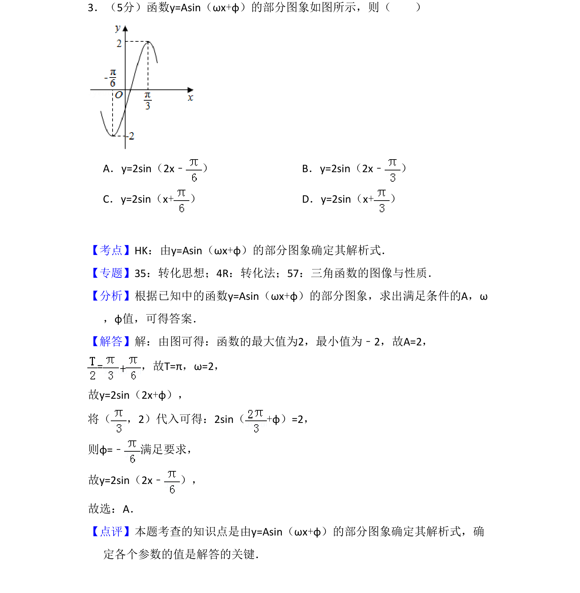
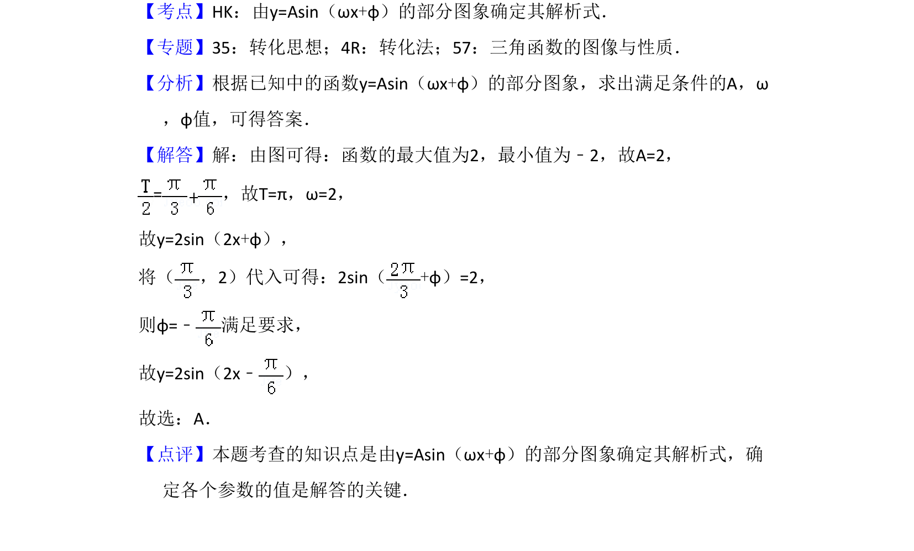

## 题面

## 摘要

本题通过部分图象求三角函数y=Asin(ωx+φ)的解析式，确定振幅、周期和初相。

## 关联考点

- [[由y=Asin(ωx+φ)的部分图象确定解析式]]
- [[三角函数图象与性质]]

## 答案与解析

> 📄 原 PDF 第 2 页：`素材/真题/吉林/2008-2024·（吉林）数学高考真题/2016年高考数学试卷（文）（新课标Ⅱ）（解析卷）.pdf`
