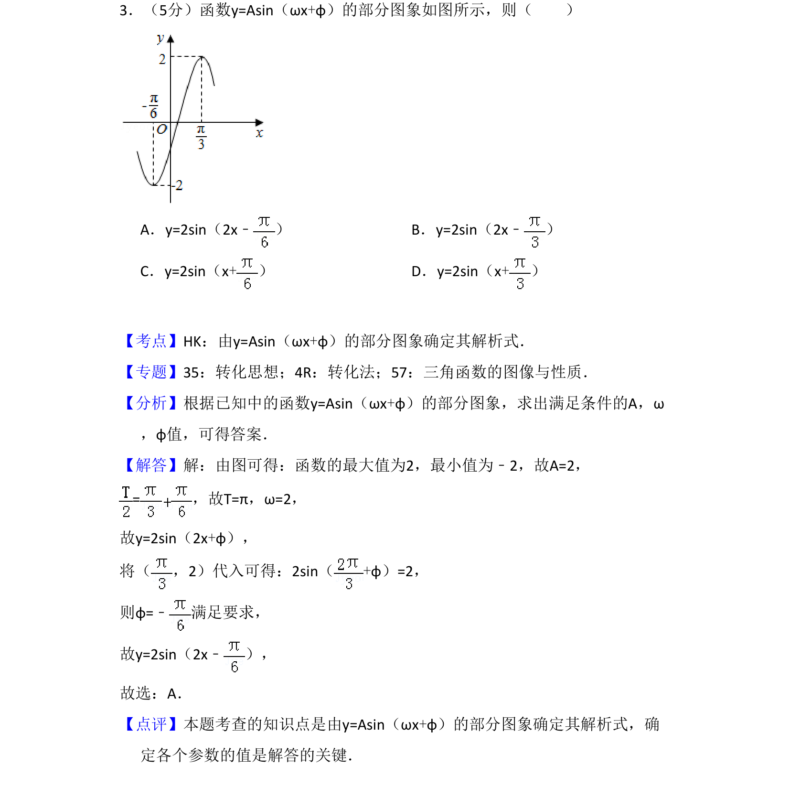
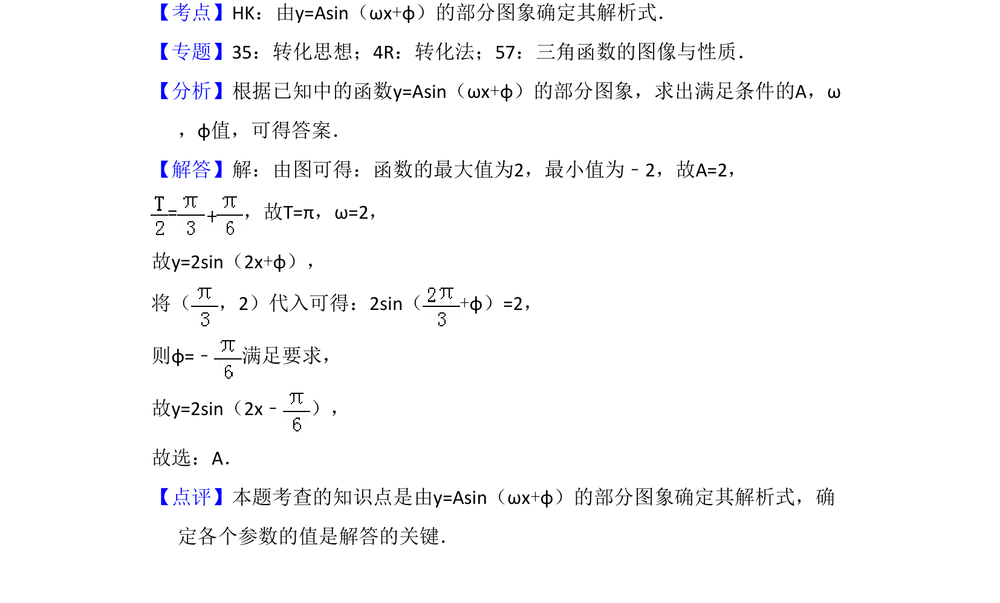

## 题面

## 摘要

本题通过部分图象求三角函数y=Asin(ωx+φ)的解析式，确定振幅、周期和初相。

## 关联考点

- [[995-由y=Asin(ωx+φ)的部分图象确定解析式|由y=Asin(ωx+φ)的部分图象确定解析式]]
- [[612-三角函数的图像与性质|三角函数图象与性质]]

## 答案与解析

> 📄 原 PDF 第 2 页：`素材/真题/吉林/2008-2024·（吉林）数学高考真题/2016年高考数学试卷（文）（新课标Ⅱ）（解析卷）.pdf`

<!-- 题干文本-start -->
## 题干文本
3．（5分）函数y=Asin（ωx+φ）的部分图象如图所示，则（　　）
A．y=2sin（2x﹣ ）B．y=2sin（2x﹣ ）
C．y=2sin（x+）D．y=2sin（x+）
<!-- 题干文本-end -->

<!-- 解析文本-start -->
## 解析文本
【考点】HK：由y=Asin（ωx+φ）的部分图象确定其解析式．菁优网版权所有
【专题】35：转化思想；4R：转化法；57：三角函数的图像与性质．
【分析】根据已知中的函数y=Asin（ωx+φ）的部分图象，求出满足条件的A，ω
，φ值，可得答案．
【解答】解：由图可得：函数的最大值为2，最小值为﹣2，故A=2，
=，故T=π，ω=2，
故y=2sin（2x+φ），
将（ ，2）代入可得：2sin（+φ）=2，
则φ=﹣ 满足要求，
故y=2sin（2x﹣ ），
故选：A．
【点评】本题考查的知识点是由y=Asin（ωx+φ）的部分图象确定其解析式，确
定各个参数的值是解答的关键．
<!-- 解析文本-end -->
