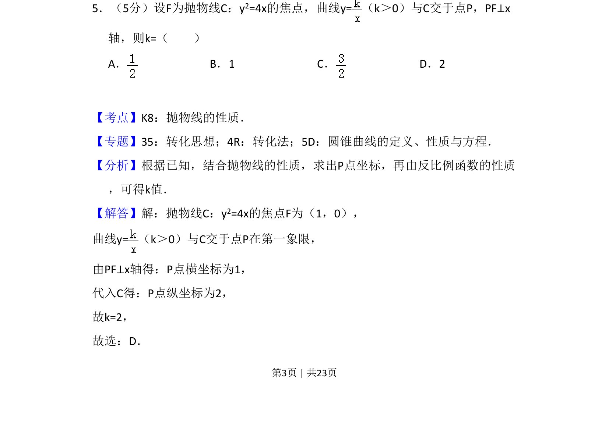
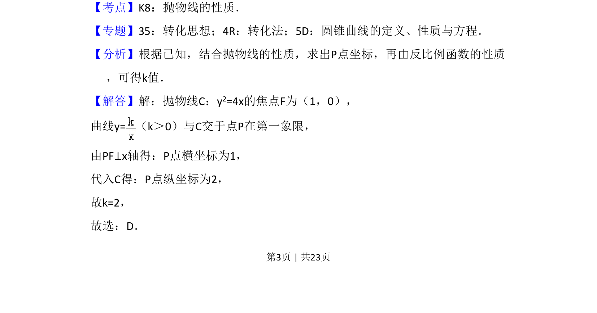
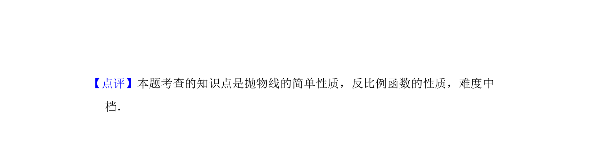

## 题面

## 摘要

由抛物线焦点与反比例函数交点及垂直条件，求参数 k 的值。

## 关联考点

- [[879-抛物线的性质|抛物线的性质]]
- [[539-反比例函数的性质|反比例函数的性质]]
- [[910-曲线交点|曲线交点]]

## 答案与解析

> 📄 原 PDF 第 3 页：`素材/真题/吉林/2008-2024·（吉林）数学高考真题/2016年高考数学试卷（文）（新课标Ⅱ）（解析卷）.pdf`
