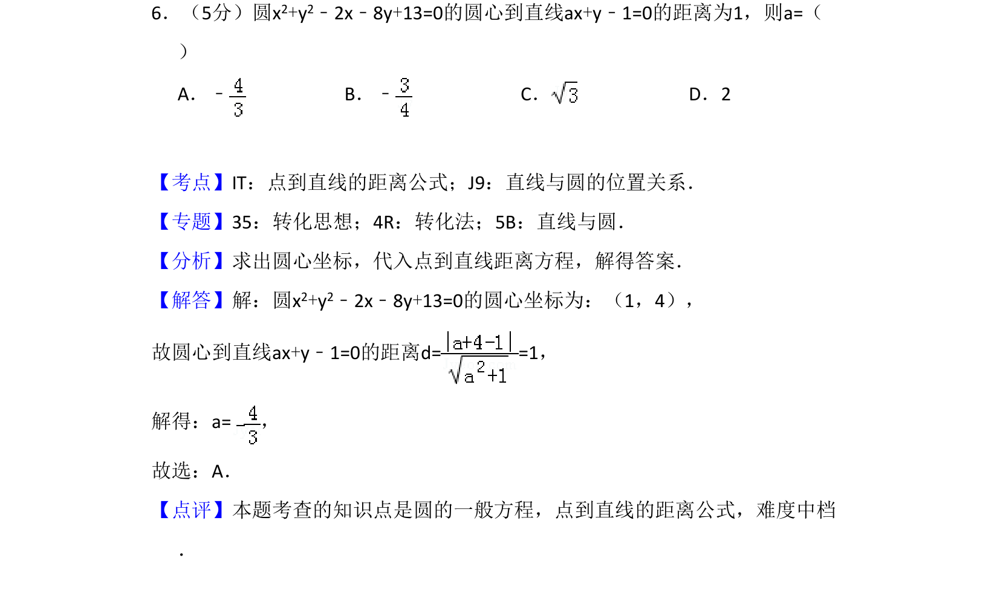
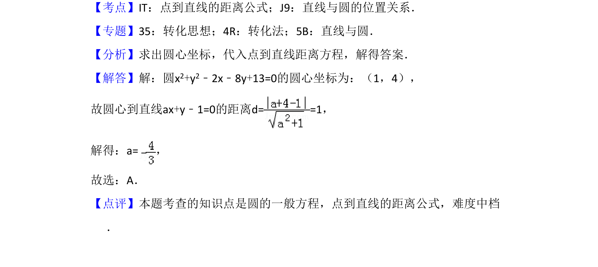

## 题面

## 摘要

已知圆方程，利用圆心到直线的距离公式求参数a的值。

## 关联考点

- [[372-圆的一般方程|圆的一般方程]]
- [[点到直线的距离公式]]
- [[394-直线和圆位置关系-高中|直线与圆的位置关系]]

## 答案与解析

> 📄 原 PDF 第 4 页：`素材/真题/吉林/2008-2024·（吉林）数学高考真题/2016年高考数学试卷（文）（新课标Ⅱ）（解析卷）.pdf`
