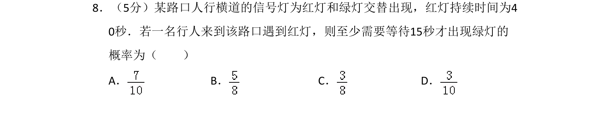
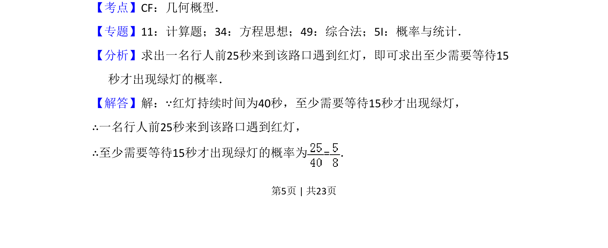
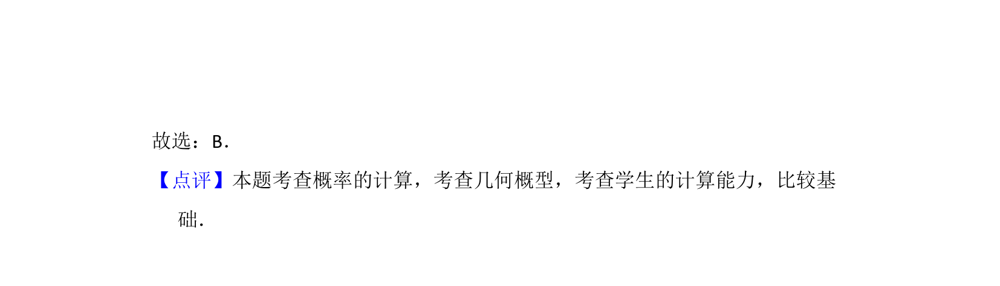

## 题面

## 摘要

本题通过行人到达路口遇红灯需等待至少15秒的情境，考查长度型几何概型的概率计算。

## 关联考点

- [[667-几何概型|几何概型]]
- [[948-概率计算|概率计算]]

## 答案与解析

> 📄 原 PDF 第 5 页：`素材/真题/吉林/2008-2024·（吉林）数学高考真题/2016年高考数学试卷（文）（新课标Ⅱ）（解析卷）.pdf`

<!-- 题干文本-start -->
## 题干文本
8．（5分）某路口人行横道的信号灯为红灯和绿灯交替出现，红灯持续时间为4
0秒．若一名行人来到该路口遇到红灯，则至少需要等待15秒才出现绿灯的
概率为（　　）
A．B．C．D．
<!-- 题干文本-end -->

<!-- 解析文本-start -->
## 解析文本
【考点】CF：几何概型．菁优网版权所有
【专题】11：计算题；34：方程思想；49：综合法；5I：概率与统计．
【分析】求出一名行人前25秒来到该路口遇到红灯，即可求出至少需要等待15
秒才出现绿灯的概率．
【解答】解：∵红灯持续时间为40秒，至少需要等待15秒才出现绿灯，
∴一名行人前25秒来到该路口遇到红灯，
∴至少需要等待15秒才出现绿灯的概率为=．
<!-- 解析文本-end -->
