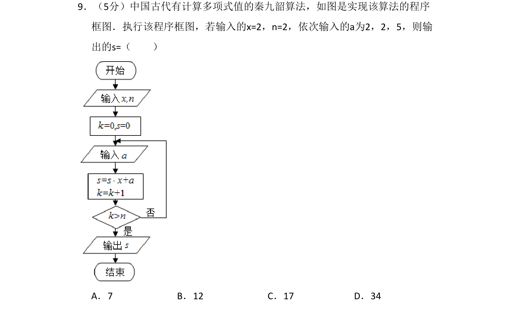
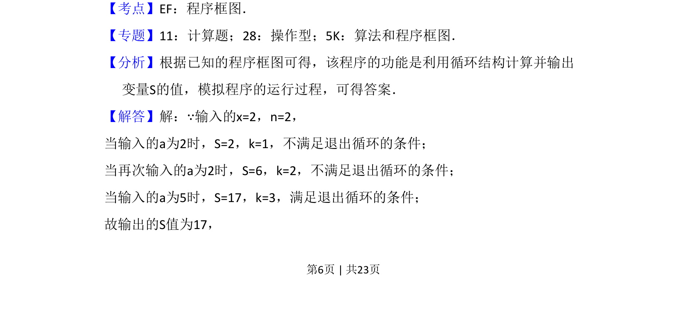
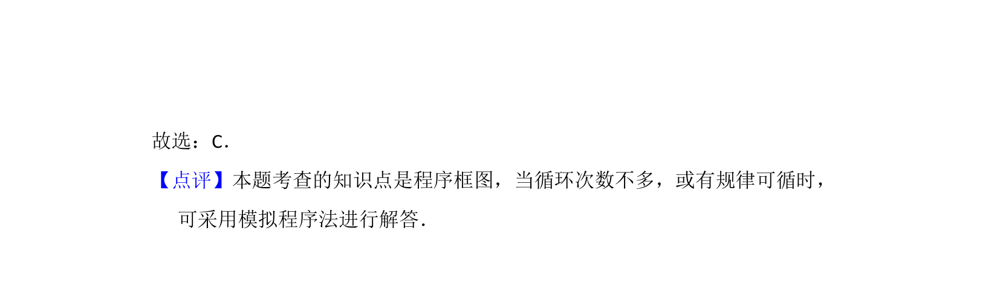

## 题面

## 摘要

该题考查秦九韶算法的程序框图，通过循环结构计算多项式值。

## 关联考点

- [[1042-程序框图|程序框图]]
- [[870-循环结构|循环结构]]
- [[1041-秦九韶算法|秦九韶算法]]

## 答案与解析

> 📄 原 PDF 第 6 页：`素材/真题/吉林/2008-2024·（吉林）数学高考真题/2016年高考数学试卷（文）（新课标Ⅱ）（解析卷）.pdf`

<!-- 题干文本-start -->
## 题干文本
9．（5分）中国古代有计算多项式值的秦九韶算法，如图是实现该算法的程序
框图．执行该程序框图，若输入的x=2，n=2，依次输入的a为2，2，5，则输
出的s=（　　）
A．7 B．12 C．17 D．34
<!-- 题干文本-end -->

<!-- 解析文本-start -->
## 解析文本
【考点】EF：程序框图．菁优网版权所有
【专题】11：计算题；28：操作型；5K：算法和程序框图．
【分析】根据已知的程序框图可得，该程序的功能是利用循环结构计算并输出
变量S的值，模拟程序的运行过程，可得答案．
【解答】解：∵输入的x=2，n=2，
当输入的a为2时，S=2，k=1，不满足退出循环的条件；
当再次输入的a为2时，S=6，k=2，不满足退出循环的条件；
当输入的a为5时，S=17，k=3，满足退出循环的条件；
故输出的S值为17，
<!-- 解析文本-end -->
