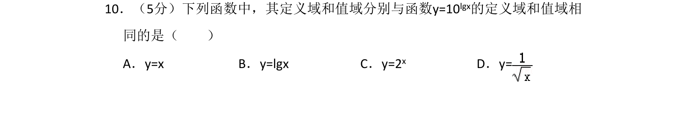
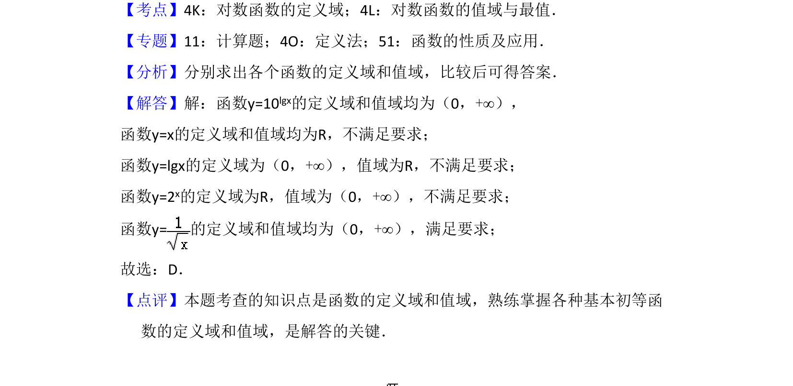

## 题面

## 摘要

比较函数定义域和值域，判断与y=10^{lgx}相同的函数

## 关联考点

- [[547-对数函数的定义域|对数函数的定义域]]
- [[830-对数函数的值域|对数函数的值域]]
- [[680-函数定义域|函数定义域]]
- [[676-函数值域|函数值域]]

## 答案与解析

> 📄 原 PDF 第 7 页：`素材/真题/吉林/2008-2024·（吉林）数学高考真题/2016年高考数学试卷（文）（新课标Ⅱ）（解析卷）.pdf`
