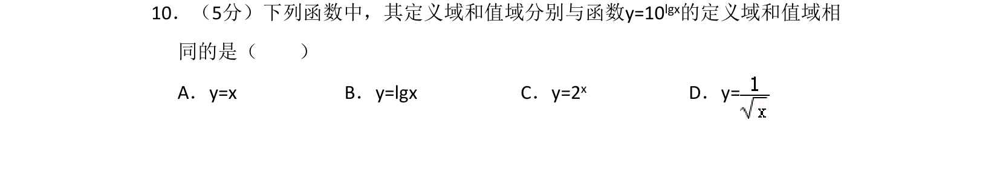
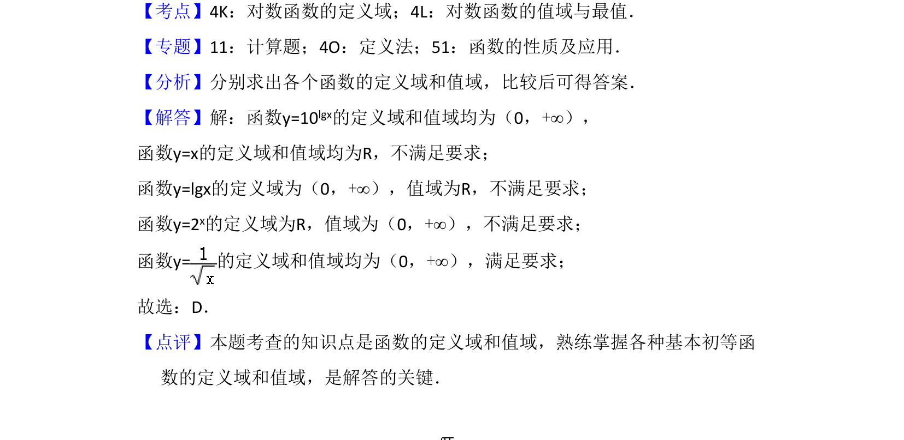

## 题面

## 摘要

比较函数定义域和值域，判断与y=10^{lgx}相同的函数

## 关联考点

- [[547-对数函数的定义域|对数函数的定义域]]
- [[829-对数函数的值域|对数函数的值域]]
- [[680-函数定义域|函数定义域]]
- [[676-函数值域|函数值域]]

## 答案与解析

> 📄 原 PDF 第 7 页：`素材/真题/吉林/2008-2024·（吉林）数学高考真题/2016年高考数学试卷（文）（新课标Ⅱ）（解析卷）.pdf`

<!-- 题干文本-start -->
## 题干文本
10．（5分）下列函数中，其定义域和值域分别与函数y=10lgx的定义域和值域相
同的是（　　）
A．y=x B．y=lgx C．y=2 x D．y=
<!-- 题干文本-end -->

<!-- 解析文本-start -->
## 解析文本
【考点】4K：对数函数的定义域；4L：对数函数的值域与最值．菁优网版权所有
【专题】11：计算题；4O：定义法；51：函数的性质及应用．
【分析】分别求出各个函数的定义域和值域，比较后可得答案．
【解答】解：函数y=10lgx的定义域和值域均为（0，+∞），
函数y=x的定义域和值域均为R，不满足要求；
函数y=lgx的定义域为（0，+∞），值域为R，不满足要求；
函数y=2x的定义域为R，值域为（0，+∞），不满足要求；
函数y=的定义域和值域均为（0，+∞），满足要求；
故选：D．
【点评】本题考查的知识点是函数的定义域和值域，熟练掌握各种基本初等函
数的定义域和值域，是解答的关键．
<!-- 解析文本-end -->
