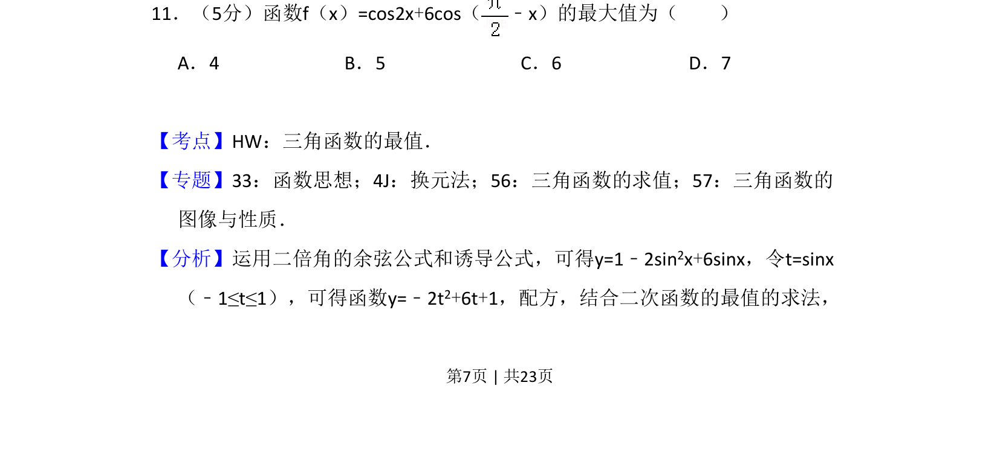
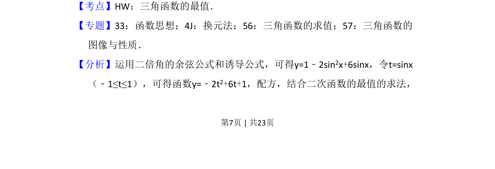
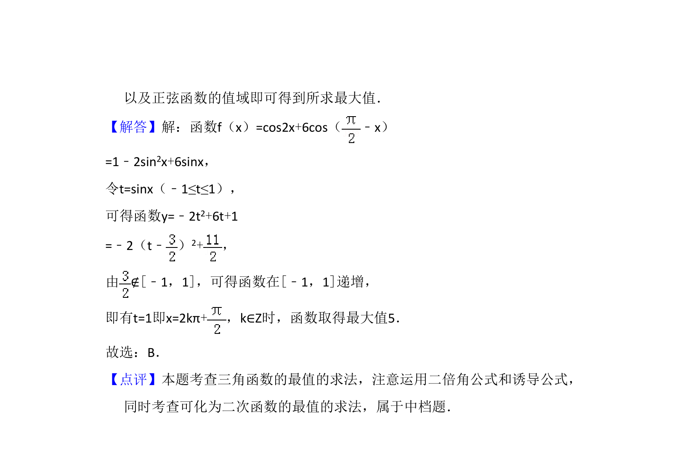

## 题面

## 摘要

运用二倍角公式与诱导公式化简三角函数为二次函数，通过换元求最值。

## 关联考点

- [[三角函数的最值]]
- [[二倍角公式]]
- [[312-诱导公式|诱导公式]]
- [[换元法]]

## 答案与解析

> 📄 原 PDF 第 7 页：`素材/真题/吉林/2008-2024·（吉林）数学高考真题/2016年高考数学试卷（文）（新课标Ⅱ）（解析卷）.pdf`
