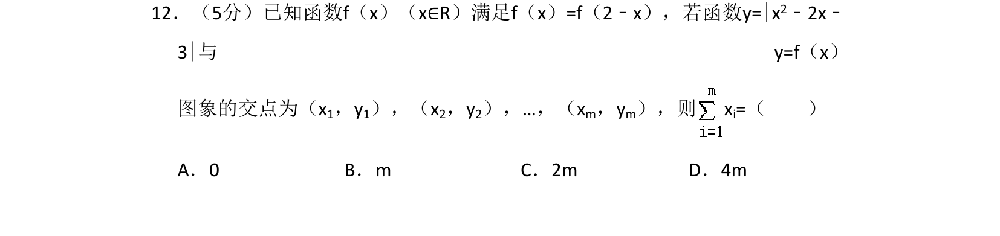
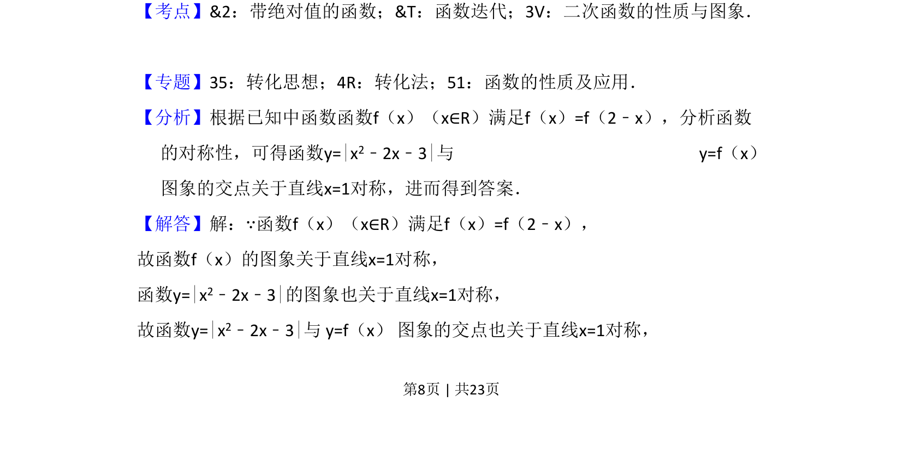
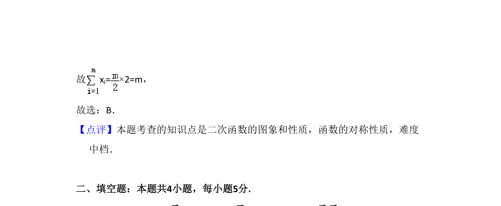

## 题面

## 摘要

函数 f(x) 关于直线 x=1 对称，与给定二次函数绝对值图像的交点横坐标之和为 m。

## 关联考点

- [[函数对称性]]
- [[绝对值函数]]
- [[187-函数图象|二次函数图象]]
- [[数形结合]]

## 答案与解析

> 📄 原 PDF 第 8 页：`素材/真题/吉林/2008-2024·（吉林）数学高考真题/2016年高考数学试卷（文）（新课标Ⅱ）（解析卷）.pdf`
