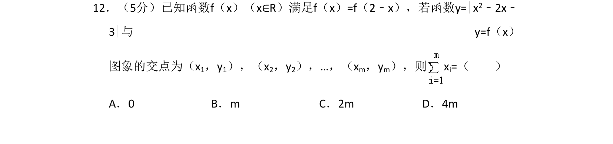
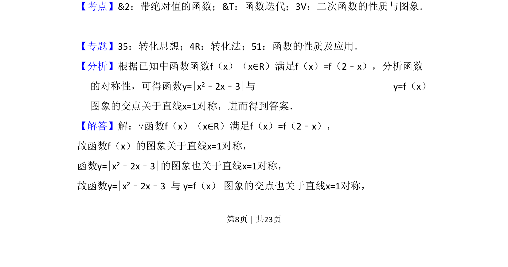
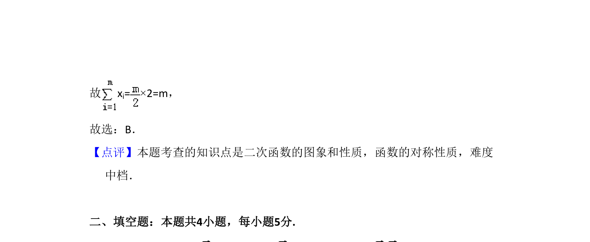

## 题面

## 摘要

函数 f(x) 关于直线 x=1 对称，与给定二次函数绝对值图像的交点横坐标之和为 m。

## 关联考点

- [[681-函数对称性|函数对称性]]
- [[585-绝对值函数|绝对值函数]]
- [[187-函数图象|二次函数图象]]
- [[897-数形结合|数形结合]]

## 答案与解析

> 📄 原 PDF 第 8 页：`素材/真题/吉林/2008-2024·（吉林）数学高考真题/2016年高考数学试卷（文）（新课标Ⅱ）（解析卷）.pdf`

<!-- 题干文本-start -->
## 题干文本
12．（5分）已知函数f（x）（x∈R）满足f（x）=f（2﹣x），若函数y=|x2﹣2x﹣
3|与 y=f（x） 
图象的交点为（x1，y1），（x2，y2），…，（xm，ym），则x i=（　　）
A．0 B．m C．2m D．4m
<!-- 题干文本-end -->

<!-- 解析文本-start -->
## 解析文本
【考点】&2：带绝对值的函数；&T：函数迭代；3V：二次函数的性质与图象．菁优网版
权所有
【专题】35：转化思想；4R：转化法；51：函数的性质及应用．
【分析】根据已知中函数函数f（x）（x∈R）满足f（x）=f（2﹣x），分析函数
的对称性，可得函数y=|x2﹣2x﹣3|与 y=f（x） 
图象的交点关于直线x=1对称，进而得到答案．
【解答】解：∵函数f（x）（x∈R）满足f（x）=f（2﹣x），
故函数f（x）的图象关于直线x=1对称，
函数y=|x2﹣2x﹣3|的图象也关于直线x=1对称，
故函数y=|x2﹣2x﹣3|与 y=f（x） 图象的交点也关于直线x=1对称，
<!-- 解析文本-end -->
