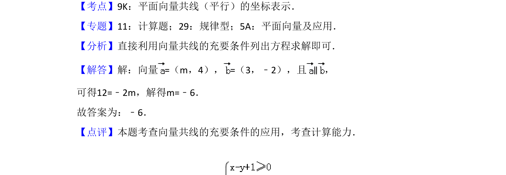

## 题面

## 摘要

已知两向量平行，利用向量共线的坐标表示求参数

## 关联考点

- [[853-平面向量|平面向量]]
- [[743-向量共线|向量共线]]
- [[788-坐标运算|坐标运算]]

## 答案与解析

> 📄 原 PDF 第 9 页：`素材/真题/吉林/2008-2024·（吉林）数学高考真题/2016年高考数学试卷（文）（新课标Ⅱ）（解析卷）.pdf`

<!-- 题干文本-start -->
## 题干文本
13．（5分）已知向量=（m，4），=（3，﹣2），且∥，则m=　﹣6　．
<!-- 题干文本-end -->

<!-- 解析文本-start -->
## 解析文本
【考点】9K：平面向量共线（平行）的坐标表示．菁优网版权所有
【专题】11：计算题；29：规律型；5A：平面向量及应用．
【分析】直接利用向量共线的充要条件列出方程求解即可．
【解答】解：向量=（m，4），=（3，﹣2），且∥，
可得12=﹣2m，解得m=﹣6．
故答案为：﹣6．
【点评】本题考查向量共线的充要条件的应用，考查计算能力．
<!-- 解析文本-end -->
