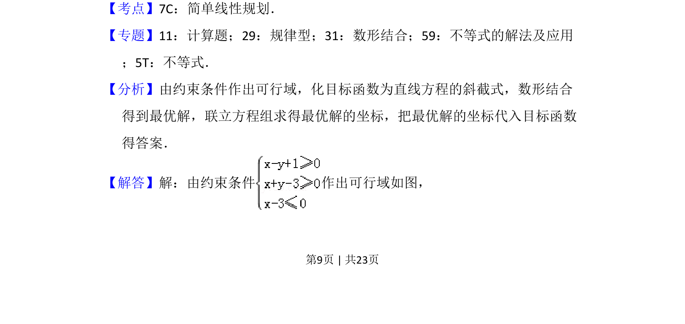
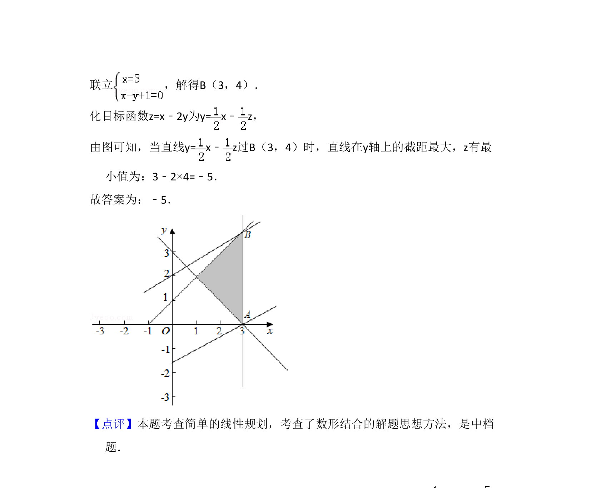

## 题面

## 摘要

该题考查线性规划问题，通过约束条件求目标函数的最小值。

## 关联考点

- [[1074-简单线性规划|简单线性规划]]
- [[1156-可行域|可行域]]
- [[999-目标函数|目标函数]]

## 答案与解析

> 📄 原 PDF 第 9 页：`素材/真题/吉林/2008-2024·（吉林）数学高考真题/2016年高考数学试卷（文）（新课标Ⅱ）（解析卷）.pdf`

<!-- 题干文本-start -->
## 题干文本
14．（5分）若x，y满足约束条件 ，则z=x﹣2y的最小值为　﹣5　．
<!-- 题干文本-end -->

<!-- 解析文本-start -->
## 解析文本
【考点】7C：简单线性规划．菁优网版权所有
【专题】11：计算题；29：规律型；31：数形结合；59：不等式的解法及应用
；5T：不等式．
【分析】由约束条件作出可行域，化目标函数为直线方程的斜截式，数形结合
得到最优解，联立方程组求得最优解的坐标，把最优解的坐标代入目标函数
得答案．
【解答】解：由约束条件 作出可行域如图，
<!-- 解析文本-end -->
