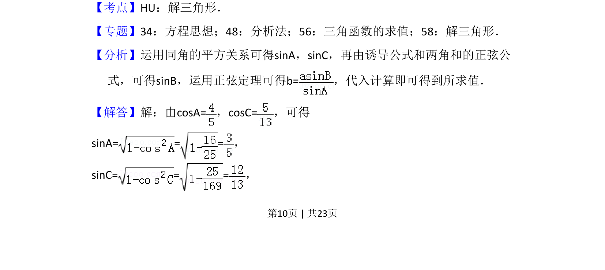
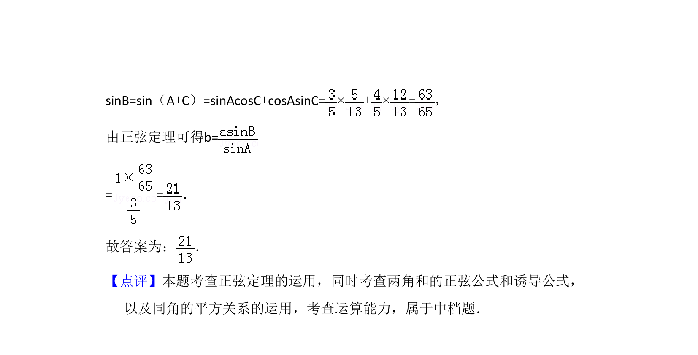

## 题面

## 摘要

已知两角的余弦和一边，用同角关系、两角和正弦公式及正弦定理求另一边

## 关联考点

- [[126-定理|正弦定理]]
- [[632-两角和正弦公式|两角和正弦公式]]
- [[1155-平方关系|同角三角函数平方关系]]

## 答案与解析

> 📄 原 PDF 第 10 页：`素材/真题/吉林/2008-2024·（吉林）数学高考真题/2016年高考数学试卷（文）（新课标Ⅱ）（解析卷）.pdf`
