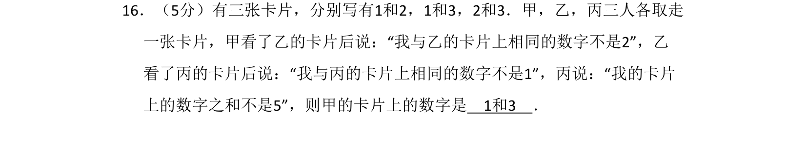
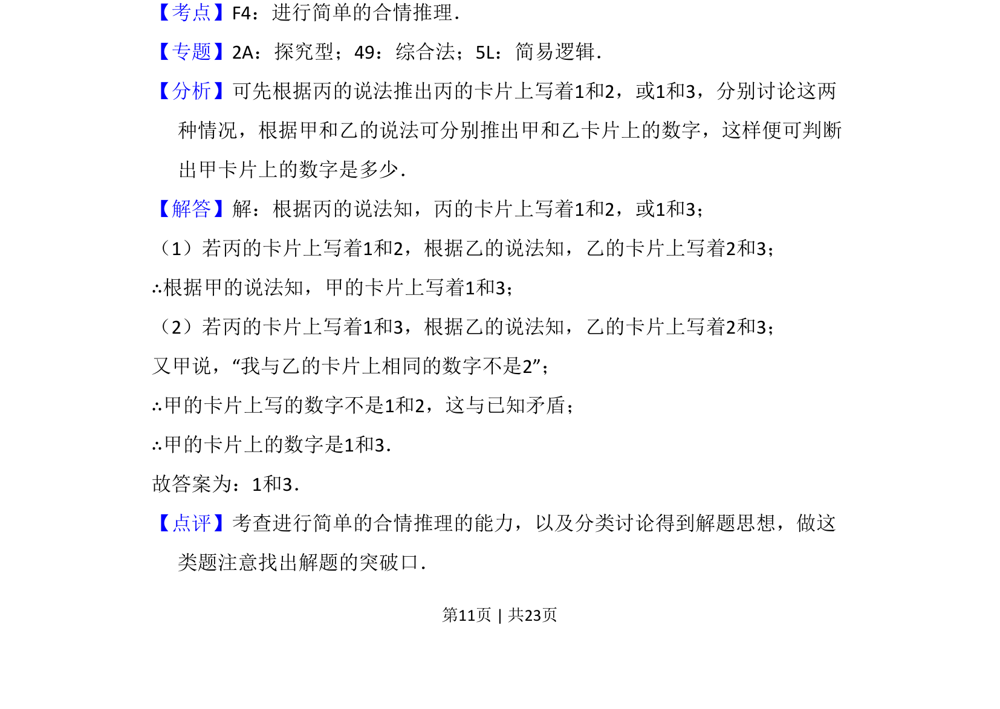
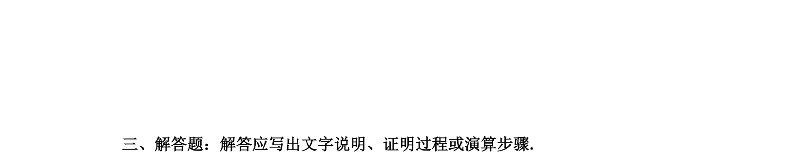

## 题面

## 摘要

通过逻辑推理与分类讨论，根据三人陈述确定卡片上的数字。

## 关联考点

- [[740-合情推理|合情推理]]
- [[037-推理|逻辑推理]]
- [[424-参数分类讨论|分类讨论]]

## 答案与解析

> 📄 原 PDF 第 11 页：`素材/真题/吉林/2008-2024·（吉林）数学高考真题/2016年高考数学试卷（文）（新课标Ⅱ）（解析卷）.pdf`

<!-- 题干文本-start -->
## 题干文本
16．（5分）有三张卡片，分别写有1和2，1和3，2和3．甲，乙，丙三人各取走
一张卡片，甲看了乙的卡片后说：“我与乙的卡片上相同的数字不是2”，乙
看了丙的卡片后说：“我与丙的卡片上相同的数字不是1”，丙说：“我的卡片
上的数字之和不是5”，则甲的卡片上的数字是　1和3　．
<!-- 题干文本-end -->

<!-- 解析文本-start -->
## 解析文本
【考点】F4：进行简单的合情推理．菁优网版权所有
【专题】2A：探究型；49：综合法；5L：简易逻辑．
【分析】可先根据丙的说法推出丙的卡片上写着1和2，或1和3，分别讨论这两
种情况，根据甲和乙的说法可分别推出甲和乙卡片上的数字，这样便可判断
出甲卡片上的数字是多少．
【解答】解：根据丙的说法知，丙的卡片上写着1和2，或1和3；
（1）若丙的卡片上写着1和2，根据乙的说法知，乙的卡片上写着2和3；
∴根据甲的说法知，甲的卡片上写着1和3；
（2）若丙的卡片上写着1和3，根据乙的说法知，乙的卡片上写着2和3；
又甲说，“我与乙的卡片上相同的数字不是2”；
∴甲的卡片上写的数字不是1和2，这与已知矛盾；
∴甲的卡片上的数字是1和3．
故答案为：1和3．
【点评】考查进行简单的合情推理的能力，以及分类讨论得到解题思想，做这
类题注意找出解题的突破口．
<!-- 解析文本-end -->
