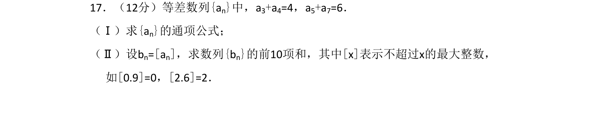
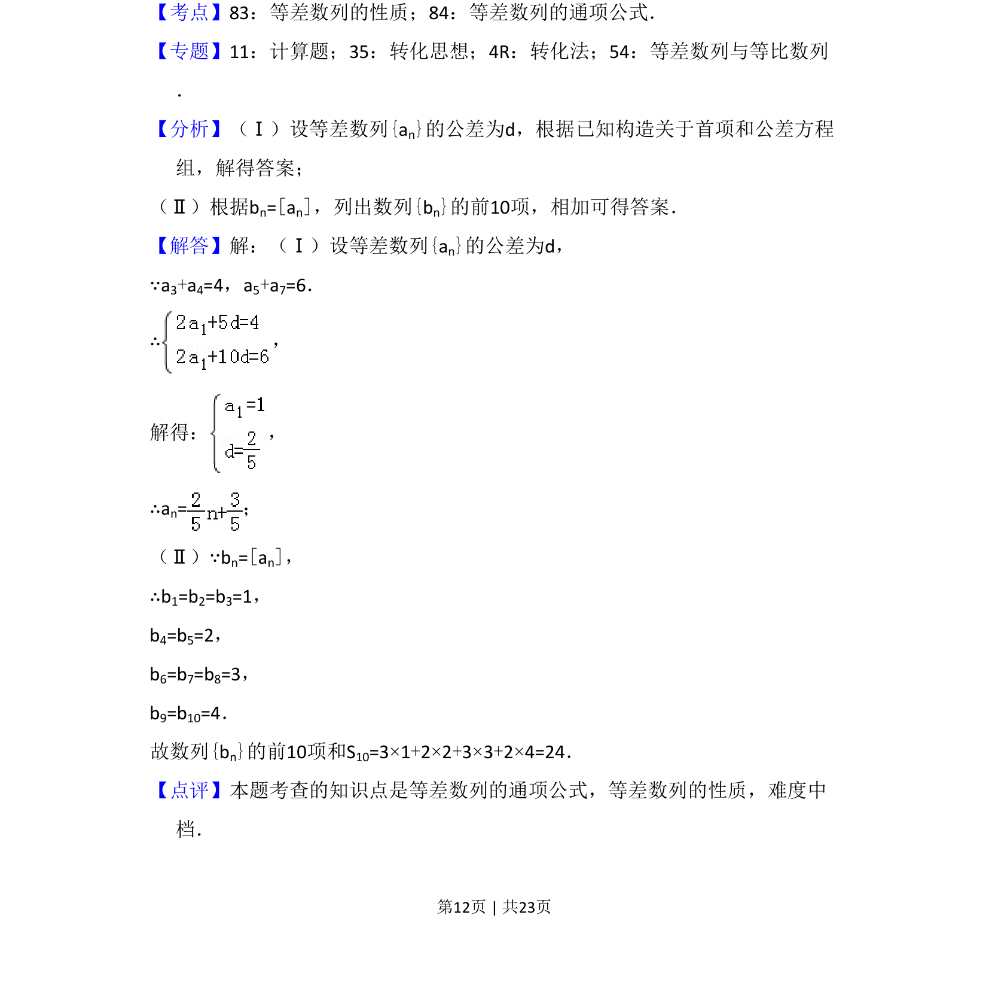

## 题面

## 摘要

等差数列通项公式与性质，结合取整函数求数列前10项和

## 关联考点

- [[412-等差数列性质|等差数列性质]]
- [[1063-等差数列通项公式|等差数列的通项公式]]
- [[1163-取整函数|取整函数]]

## 答案与解析

> 📄 原 PDF 第 12 页：`素材/真题/吉林/2008-2024·（吉林）数学高考真题/2016年高考数学试卷（文）（新课标Ⅱ）（解析卷）.pdf`

<!-- 题干文本-start -->
## 题干文本
17．（12分）等差数列{an}中，a3+a4=4，a5+a7=6．
（Ⅰ）求{an}的通项公式；
（Ⅱ）设bn=[an]，求数列{bn}的前10项和，其中[x]表示不超过x的最大整数，
如[0.9]=0，[2.6]=2．
<!-- 题干文本-end -->

<!-- 解析文本-start -->
## 解析文本
【考点】83：等差数列的性质；84：等差数列的通项公式．菁优网版权所有
【专题】11：计算题；35：转化思想；4R：转化法；54：等差数列与等比数列
．
【分析】（Ⅰ）设等差数列{an}的公差为d，根据已知构造关于首项和公差方程
组，解得答案；
（Ⅱ）根据bn=[an]，列出数列{bn}的前10项，相加可得答案．
【解答】解：（Ⅰ）设等差数列{an}的公差为d，
∵a3+a4=4，a5+a7=6．
∴，
解得： ，
∴an=；
（Ⅱ）∵bn=[an]，
∴b1=b2=b3=1，
b4=b5=2，
b6=b7=b8=3，
b9=b10=4．
故数列{bn}的前10项和S10=3×1+2×2+3×3+2×4=24．
【点评】本题考查的知识点是等差数列的通项公式，等差数列的性质，难度中
档．
<!-- 解析文本-end -->
