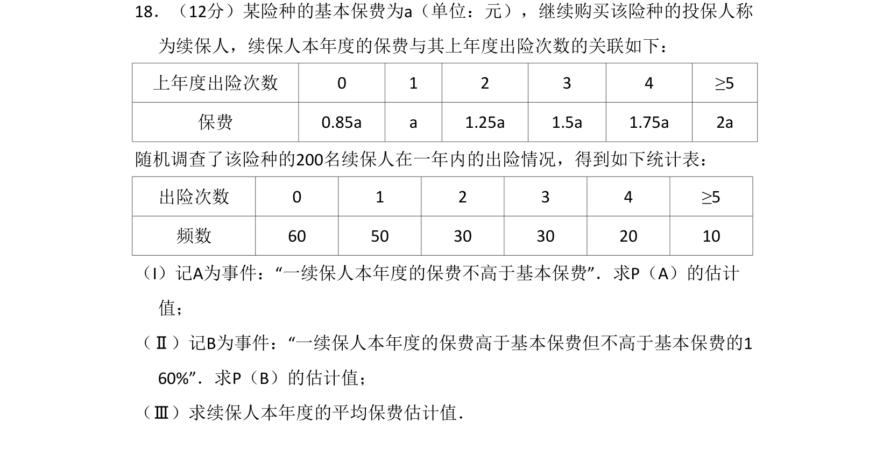
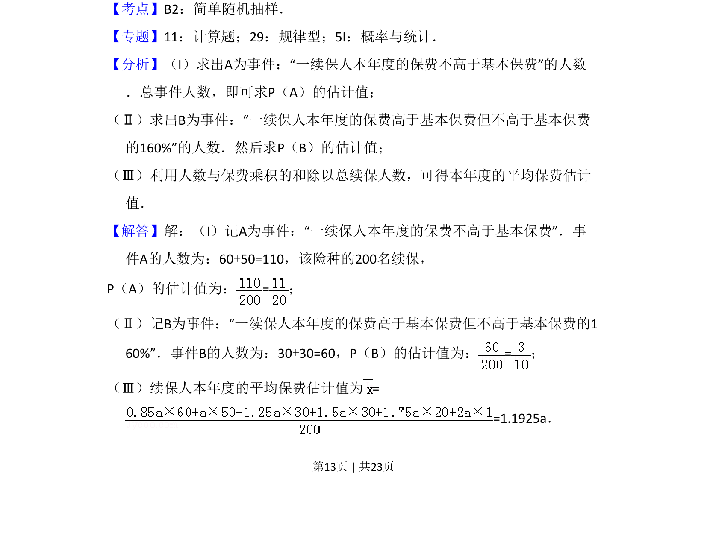
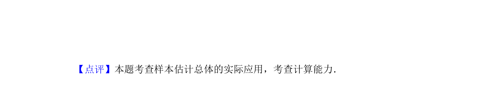

## 题面

## 摘要

根据出险频数表估计保费概率及加权平均保费

## 关联考点

- [[362-随机抽样-简单|简单随机抽样]]
- [[1187-频率估计概率|频率估计概率]]
- [[055-平均数|加权平均数]]

## 答案与解析

> 📄 原 PDF 第 13 页：`素材/真题/吉林/2008-2024·（吉林）数学高考真题/2016年高考数学试卷（文）（新课标Ⅱ）（解析卷）.pdf`

<!-- 题干文本-start -->
## 题干文本
18．（12分）某险种的基本保费为a（单位：元），继续购买该险种的投保人称
为续保人，续保人本年度的保费与其上年度出险次数的关联如下：
上年度出险次数 0 1 2 3 4 ≥5
保费 0.85a a 1.25a 1.5a 1.75a 2a
随机调查了该险种的200名续保人在一年内的出险情况，得到如下统计表：
出险次数 0 1 2 3 4 ≥5
频数 60 50 30 30 20 10
（I）记A为事件：“一续保人本年度的保费不高于基本保费”．求P（A）的估计
值；
（Ⅱ）记B为事件：“一续保人本年度的保费高于基本保费但不高于基本保费的1
60%”．求P（B）的估计值；
（Ⅲ）求续保人本年度的平均保费估计值．
<!-- 题干文本-end -->

<!-- 解析文本-start -->
## 解析文本
【考点】B2：简单随机抽样．菁优网版权所有
【专题】11：计算题；29：规律型；5I：概率与统计．
【分析】（I）求出A为事件：“一续保人本年度的保费不高于基本保费”的人数
．总事件人数，即可求P（A）的估计值；
（Ⅱ）求出B为事件：“一续保人本年度的保费高于基本保费但不高于基本保费
的160%”的人数．然后求P（B）的估计值；
（Ⅲ）利用人数与保费乘积的和除以总续保人数，可得本年度的平均保费估计
值．
【解答】解：（I）记A为事件：“一续保人本年度的保费不高于基本保费”．事
件A的人数为：60+50=110，该险种的200名续保，
P（A）的估计值为：=；
（Ⅱ）记B为事件：“一续保人本年度的保费高于基本保费但不高于基本保费的1
60%”．事件B的人数为：30+30=60，P（B）的估计值为：=；
（Ⅲ）续保人本年度的平均保费估计值为=
=1.1925a．
<!-- 解析文本-end -->
