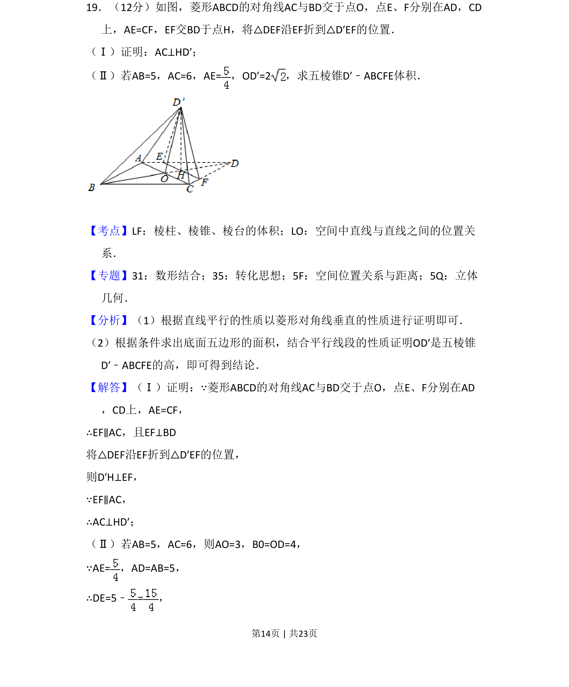
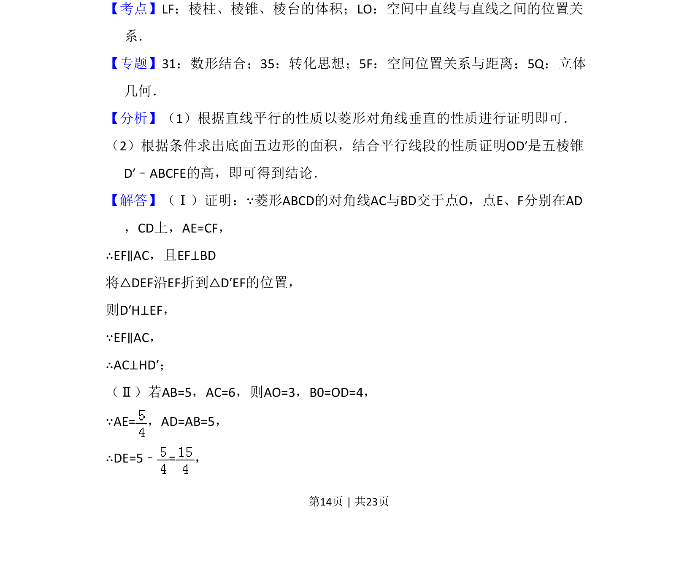
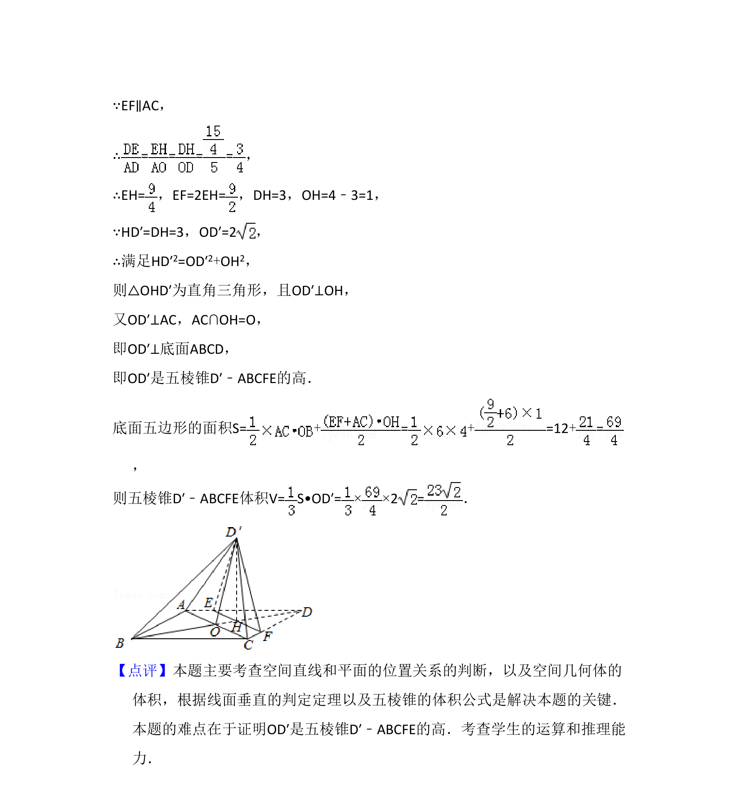

## 题面

## 摘要

本题考查菱形折叠后线线垂直证明及五棱锥体积计算。

## 关联考点

- [[351-空间直线平面垂直|线面垂直]]
- [[棱锥体积]]
- [[350-空间点直线平面位置关系|空间位置关系]]

## 答案与解析

> 📄 原 PDF 第 14 页：`素材/真题/吉林/2008-2024·（吉林）数学高考真题/2016年高考数学试卷（文）（新课标Ⅱ）（解析卷）.pdf`
