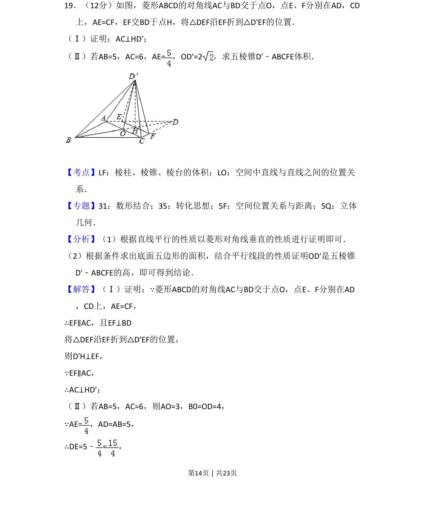
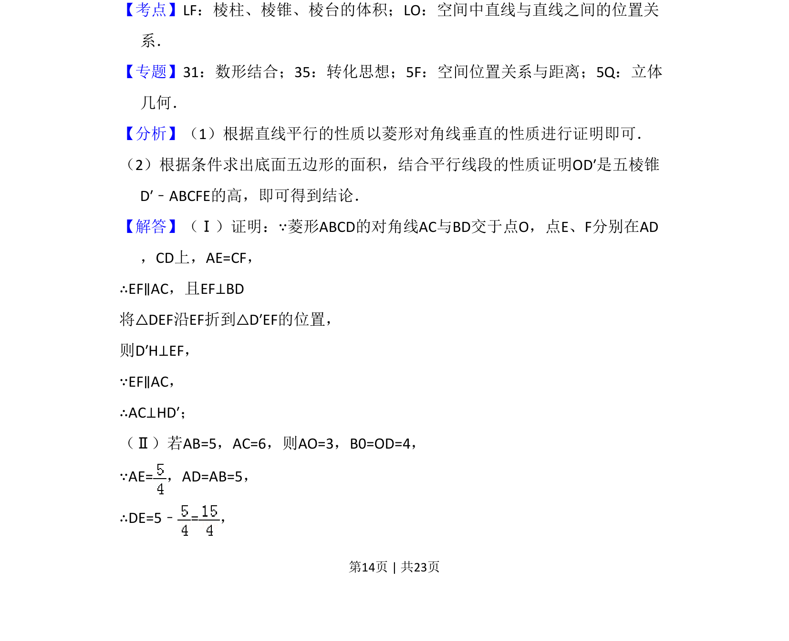
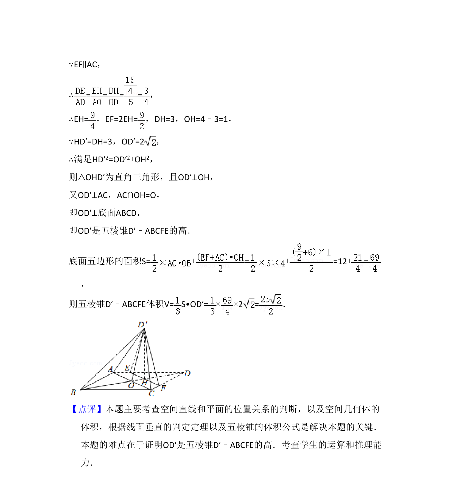

## 题面

## 摘要

菱形ABCD折叠成立体图形后证明AC⊥HD'（线线垂直），再求五棱锥D'-ABCFE的体积。

## 关联考点

- [[1083-线线垂直|线线垂直]]
- [[936-棱锥体积|棱锥体积]]
- [[1055-立体几何|立体几何]]

## 答案与解析

> 📄 原 PDF 第 14 页：`素材/真题/吉林/2008-2024·（吉林）数学高考真题/2016年高考数学试卷（文）（新课标Ⅱ）（解析卷）.pdf`

<!-- 题干文本-start -->
## 题干文本
19．（12分）如图，菱形ABCD的对角线AC与BD交于点O，点E、F分别在AD，CD
上，AE=CF，EF交BD于点H，将△DEF沿EF折到△D′EF的位置．
（Ⅰ）证明：AC⊥HD′；
（Ⅱ）若AB=5，AC=6，AE=，OD′=2，求五棱锥D′﹣ABCFE体积．
<!-- 题干文本-end -->

<!-- 解析文本-start -->
## 解析文本
【考点】LF：棱柱、棱锥、棱台的体积；LO：空间中直线与直线之间的位置关
系．菁优网版权所有
【专题】31：数形结合；35：转化思想；5F：空间位置关系与距离；5Q：立体
几何．
【分析】（1）根据直线平行的性质以菱形对角线垂直的性质进行证明即可．
（2）根据条件求出底面五边形的面积，结合平行线段的性质证明OD′是五棱锥
D′﹣ABCFE的高，即可得到结论．
【解答】（Ⅰ）证明：∵菱形ABCD的对角线AC与BD交于点O，点E、F分别在AD
，CD上，AE=CF，
∴EF∥AC，且EF⊥BD
将△DEF沿EF折到△D′EF的位置，
则D′H⊥EF，
∵EF∥AC，
∴AC⊥HD′；
（Ⅱ）若AB=5，AC=6，则AO=3，B0=OD=4，
∵AE=，AD=AB=5，
∴DE=5﹣=，
<!-- 解析文本-end -->
