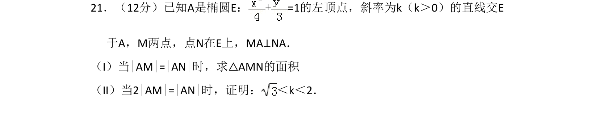
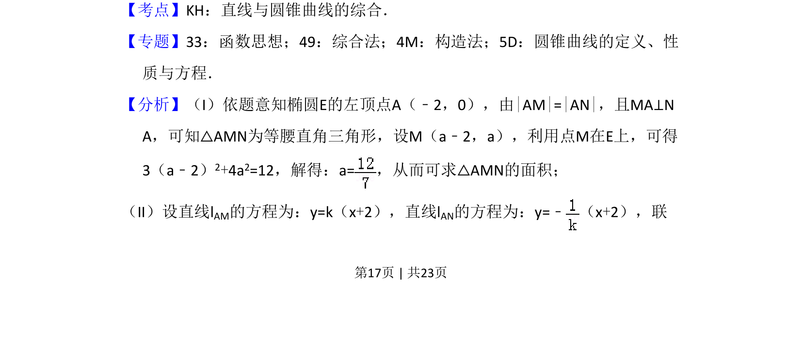
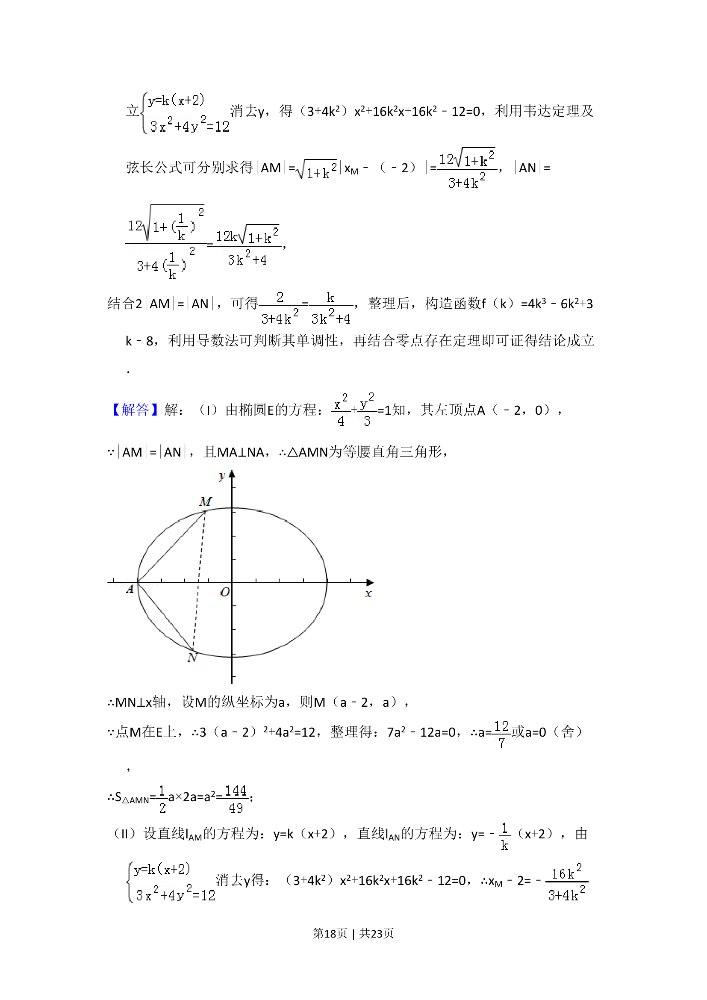
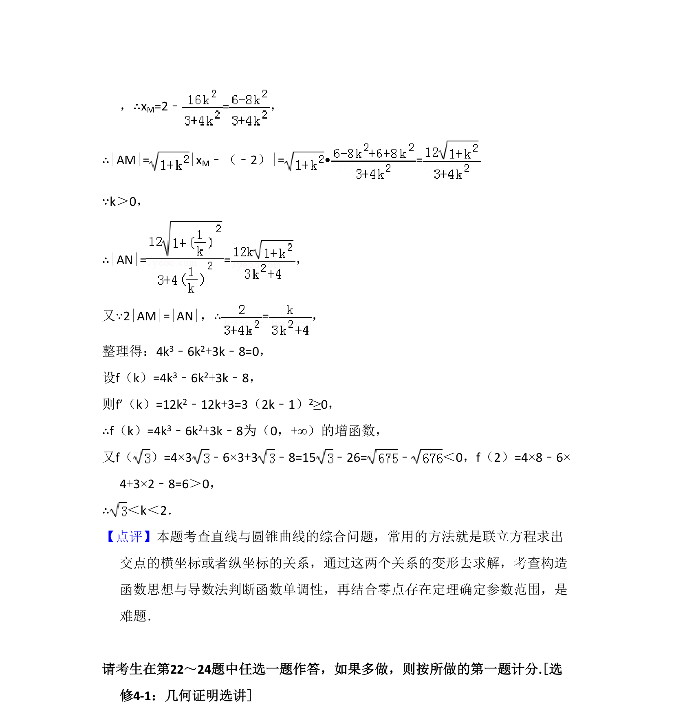

## 题面

## 摘要

本题主要考查椭圆与直线的位置关系，通过几何条件求三角形面积并证明参数不等式。

## 关联考点

- [[015-位置|直线与椭圆的位置关系]]
- [[062-多边形面积|三角形面积]]
- [[不等式证明]]

## 答案与解析

> 📄 原 PDF 第 17 页：`素材/真题/吉林/2008-2024·（吉林）数学高考真题/2016年高考数学试卷（文）（新课标Ⅱ）（解析卷）.pdf`
