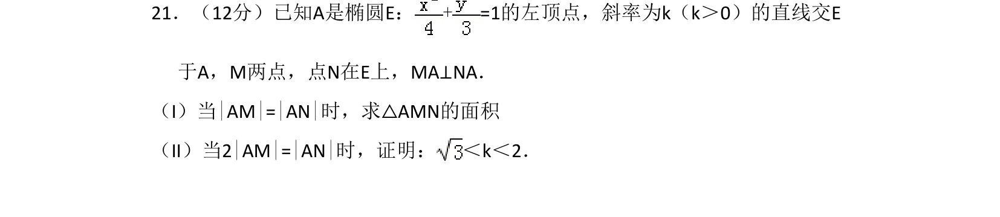
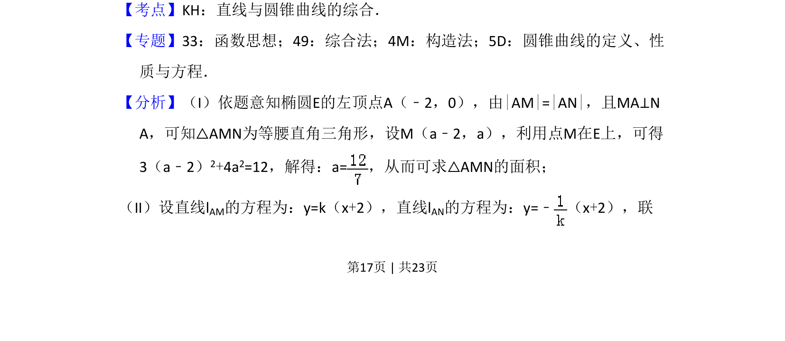
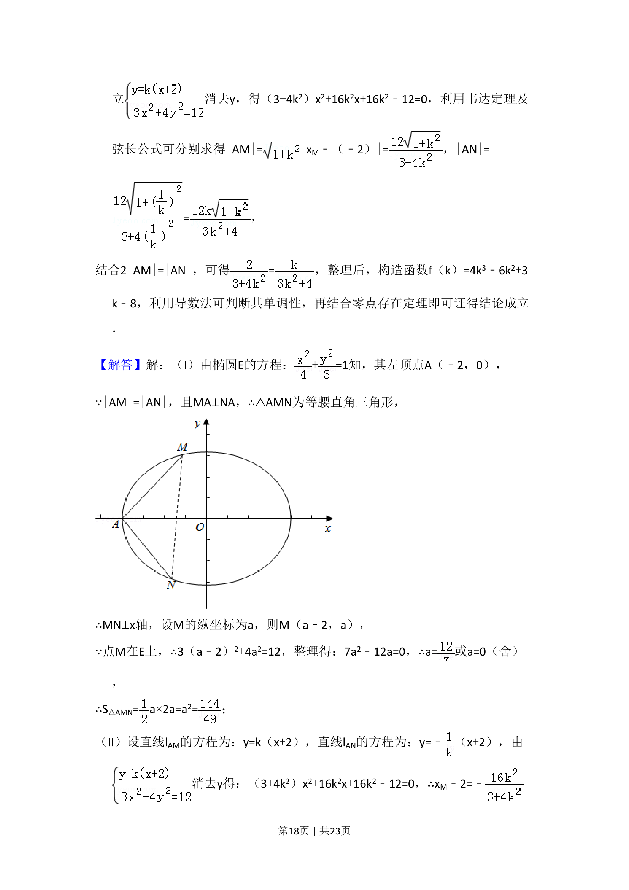
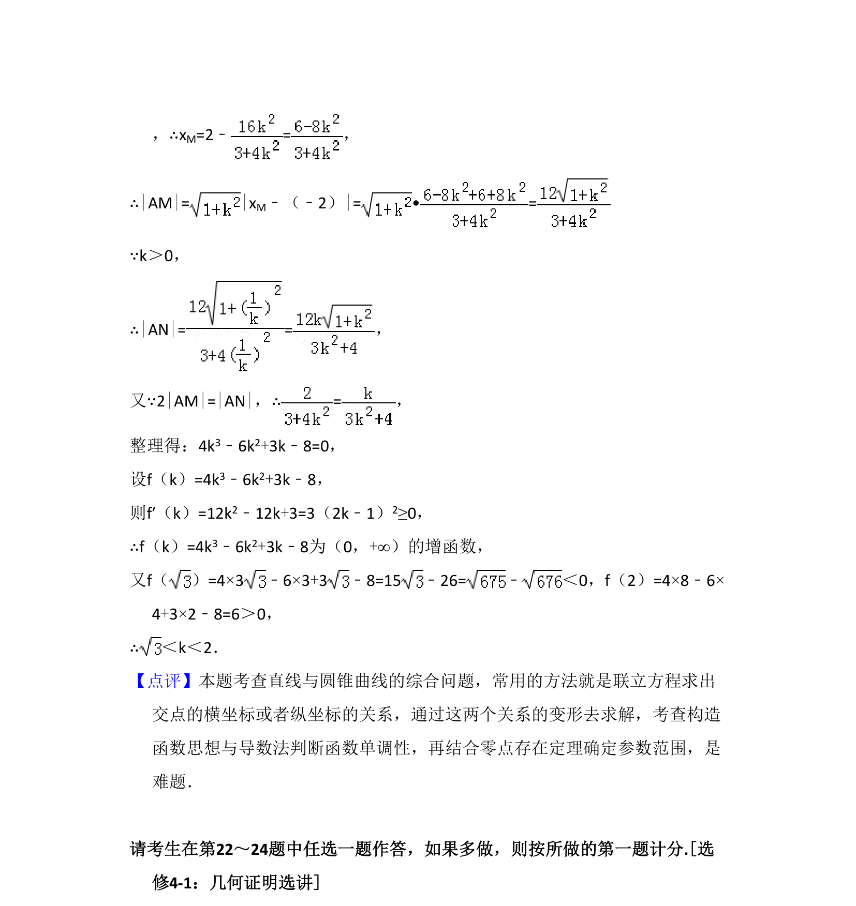

## 题面

## 摘要

本题主要考查椭圆与直线的位置关系，通过几何条件求三角形面积并证明参数不等式。

## 关联考点

- [[015-位置|直线与椭圆的位置关系]]
- [[062-多边形面积|三角形面积]]
- [[624-不等式的证明|不等式证明]]

## 答案与解析

> 📄 原 PDF 第 17 页：`素材/真题/吉林/2008-2024·（吉林）数学高考真题/2016年高考数学试卷（文）（新课标Ⅱ）（解析卷）.pdf`

<!-- 题干文本-start -->
## 题干文本
21．（12分）已知A是椭圆E：+=1的左顶点，斜率为k（k＞0）的直线交E
于A，M两点，点N在E上，MA⊥NA．
（I）当|AM|=|AN|时，求△AMN的面积
（II）当2|AM|=|AN|时，证明： ＜k＜2．
<!-- 题干文本-end -->

<!-- 解析文本-start -->
## 解析文本
【考点】KH：直线与圆锥曲线的综合．菁优网版权所有
【专题】33：函数思想；49：综合法；4M：构造法；5D：圆锥曲线的定义、性
质与方程．
【分析】（I）依题意知椭圆E的左顶点A（﹣2，0），由|AM|=|AN|，且MA⊥N
A，可知△AMN为等腰直角三角形，设M（a﹣2，a），利用点M在E上，可得
3（a﹣2）2+4a2=12，解得：a=，从而可求△AMN的面积；
（II）设直线lAM的方程为：y=k（x+2），直线lAN的方程为：y=﹣ （x+2），联
<!-- 解析文本-end -->
