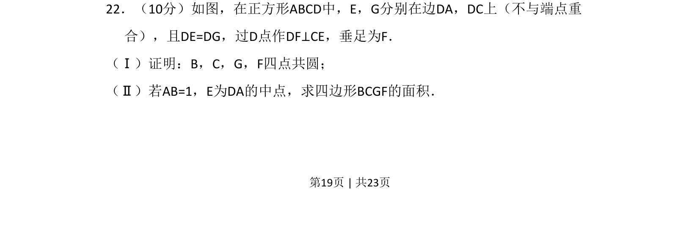

## 题面

## 摘要

正方形内构造等长线段与垂线，证明四点共圆并计算四边形面积。

## 关联考点

- [[四点共圆]]
- [[正方形性质]]
- [[189-勾股定理|勾股定理]]
- [[面积计算]]

## 答案与解析

> 📄 原 PDF 第 19 页：`素材/真题/吉林/2008-2024·（吉林）数学高考真题/2016年高考数学试卷（文）（新课标Ⅱ）（解析卷）.pdf`
