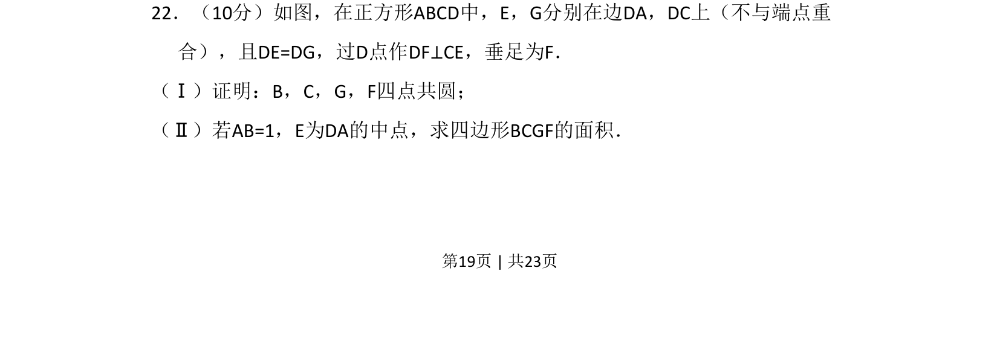
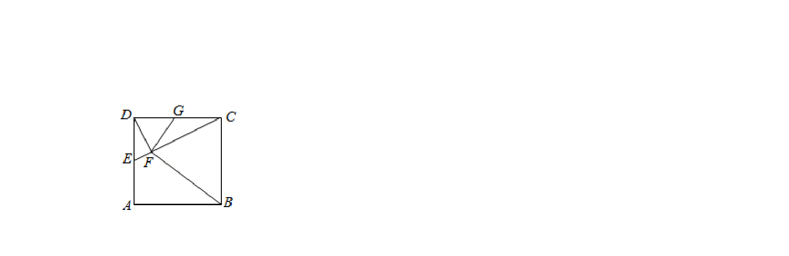
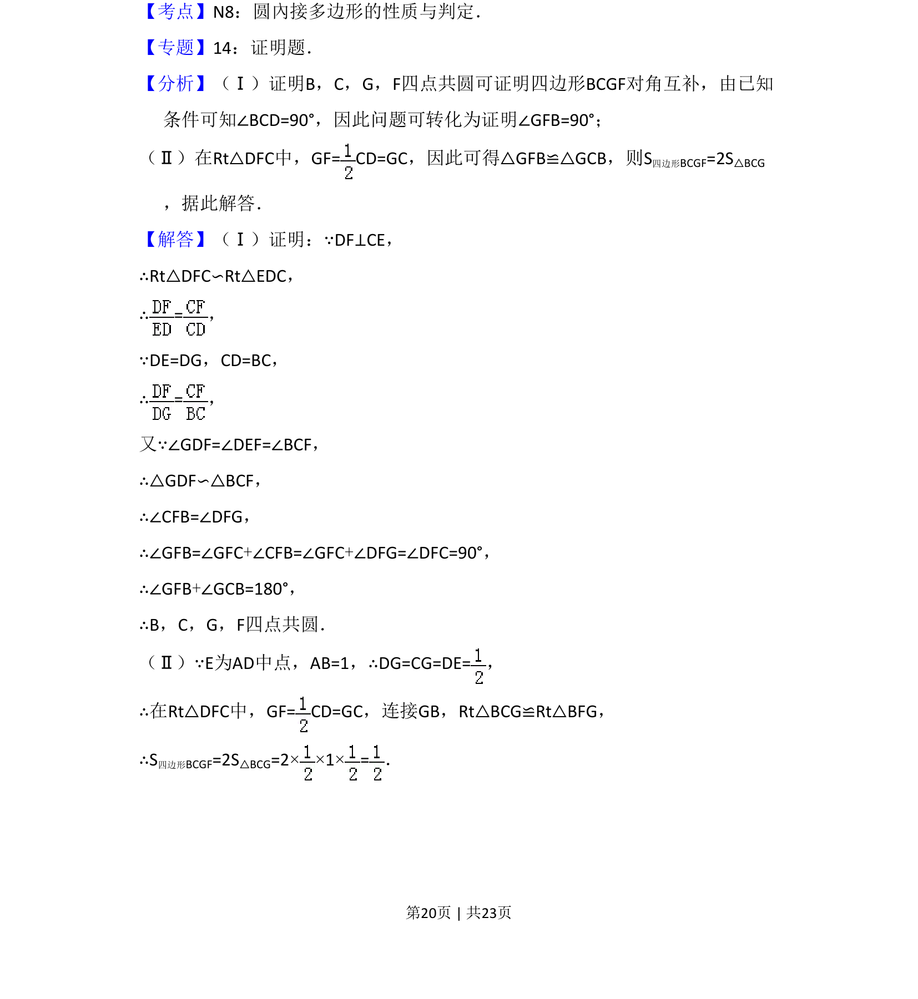
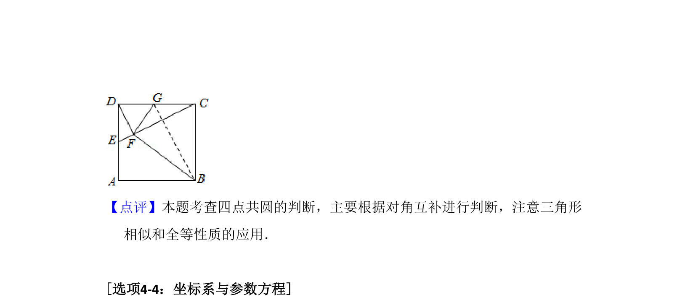

## 题面

## 摘要

正方形内构造等长线段与垂线，证明四点共圆并计算四边形面积。

## 关联考点

- [[766-四点共圆|四点共圆]]
- [[968-正方形性质|正方形性质]]
- [[189-勾股定理|勾股定理]]
- [[1146-面积计算|面积计算]]

## 答案与解析

> 📄 原 PDF 第 19 页：`素材/真题/吉林/2008-2024·（吉林）数学高考真题/2016年高考数学试卷（文）（新课标Ⅱ）（解析卷）.pdf`

<!-- 题干文本-start -->
## 题干文本
22．（10分）如图，在正方形ABCD中，E，G分别在边DA，DC上（不与端点重
合），且DE=DG，过D点作DF⊥CE，垂足为F．
（Ⅰ）证明：B，C，G，F四点共圆；
（Ⅱ）若AB=1，E为DA的中点，求四边形BCGF的面积．
<!-- 题干文本-end -->

<!-- 解析文本-start -->
## 解析文本

<!-- 解析文本-end -->
